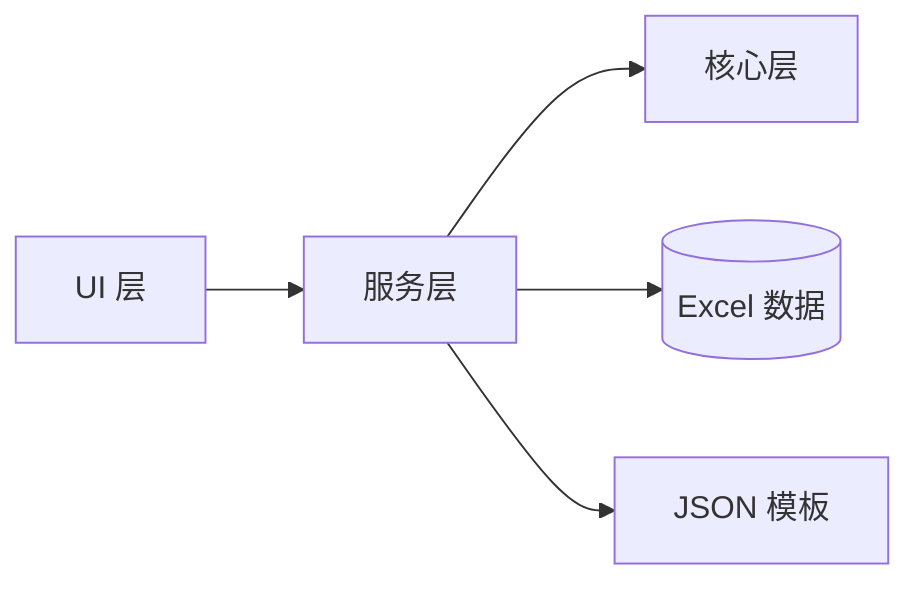

# 工作日志桌面应用 Wiki

本文档库提供了 **工作日志桌面应用 (WorkLogApp)** 的详细技术文档，涵盖架构设计、接口规范、数据结构及运维指南。

## 📚 文档目录

### 1. [技术架构](./1-技术架构.md)
系统整体分层架构、核心模块职责说明及关键数据流向图。

### 2. [API 接口规范](./2-API接口.md)
服务层核心接口 (`ITemplateService`, `IImportExportService`) 定义与调用说明。

### 3. [数据库设计](./3-数据库设计.md)
基于 Excel 的文件存储结构定义、JSON 模板配置格式说明。

### 4. [部署运维手册](./4-部署运维.md)
环境要求、安装配置、备份恢复策略及日志排错指南。

### 5. [性能优化指南](./5-性能优化.md)
针对 Excel 读写、UI 渲染及大批量数据场景的优化策略。

### 6. [常见问题解决方案](./6-常见问题.md)
用户及开发者常见问题 (FAQ) 汇总。

---

## 🏗️ 快速概览

建议阅读顺序：
1. 先阅读 **[技术架构](./1-技术架构.md)** 建立全局认知。
2. 查阅 **[数据库设计](./3-数据库设计.md)** 理解数据存储方式。
3. 根据开发或运维需求，深入阅读 **[API 接口](./2-API接口.md)** 或 **[部署运维](./4-部署运维.md)**。
