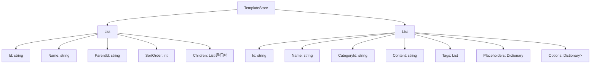

# 分类/模板数据 SQLite 迁移评估报告

**评估日期**: 2026-03-03  
**评估对象**: Category 和 WorkTemplate 数据  
**当前存储**: JSON 文件 (`Templates/templates.json`)

---

## 1. 现有架构分析

### 1.1 数据模型



### 1.2 使用场景分析

| 使用方 | 操作 | 频率 | 性能敏感度 |
|-------|------|------|-----------|
| `MainForm` | `GetAllCategories()` | 启动时一次 | 低 |
| `ItemCreateForm` | `GetAllCategories()` + `GetTemplatesByCategory()` | 打开表单时 | 中 |
| `CategoryManageForm` | CRUD 操作 | 用户主动操作 | 低 |
| `CategoryTreeComboBox` | `GetAllCategories()` | 每次下拉时 | 中 |

### 1.3 当前实现特点

```csharp
// TemplateService 核心特征
private TemplateStore _store;  // 内存缓存
private readonly object _lock = new object();  // 文件操作锁

// 全量加载，操作内存，定期保存
public List<Category> GetAllCategories() 
{
    lock (_lock) 
    {
        return _store?.Categories.OrderBy(c => c.SortOrder).ToList();
    }
}
```

**特点**:
- 全量加载到内存，操作完成后写回文件
- 使用 `lock` 保证线程安全
- 数据量通常很小（分类<100，模板<500）
- 启动时加载一次，后续操作内存对象

---

## 2. 迁移到 SQLite 的利弊分析

### 2.1 优势

| 优势 | 说明 | 实际价值 |
|------|------|---------|
| **数据一致性** | 外键约束、事务支持 | 中 - 分类和模板关联简单，当前实现已通过应用层保证 |
| **查询能力** | SQL查询、索引优化 | 低 - 数据量小，全量加载已满足需求 |
| **并发安全** | 数据库级锁机制 | 中 - 可替代当前的 `lock` 和文件锁 |
| **统一存储** | 所有数据在一个数据库 | 中 - 减少文件数量，备份更简单 |

### 2.2 劣势

| 劣势 | 说明 | 影响程度 |
|------|------|---------|
| **复杂度增加** | 需要处理字典/列表的序列化 | 高 - `Placeholders` 和 `Options` 是复杂对象 |
| **性能开销** | 每次查询需要数据库访问 | 中 - 当前内存操作更快 |
| **迁移成本** | 需要迁移现有模板数据 | 中 - 需要编写迁移脚本 |
| **代码重构** | TemplateService 需要大量修改 | 高 - 当前实现假设全量内存操作 |

### 2.3 关键挑战：复杂类型的存储

`WorkTemplate` 包含两个复杂字典属性：

```csharp
public Dictionary<string, string> Placeholders { get; set; }        // 表单字段定义
public Dictionary<string, List<string>> Options { get; set; }       // 下拉选项
```

**SQLite 存储选项对比**：

| 方案 | 实现复杂度 | 查询能力 | 维护性 | 推荐度 |
|------|-----------|---------|-------|-------|
| A. JSON 字符串列 | 低 | 无 | 高 | ⭐⭐⭐ |
| B. 单独表 + 关联 | 高 | 中 | 低 | ⭐⭐ |
| C. 保持 JSON 文件 | 无 | 无 | 高 | ⭐⭐⭐⭐ |

---

## 3. 建议方案对比

### 方案 A：完全迁移到 SQLite

将所有分类和模板数据迁移到 SQLite。

**表结构设计**：
```sql
-- Categories 表（已在主方案中定义）
CREATE TABLE Categories (
    Id TEXT PRIMARY KEY,
    Name TEXT NOT NULL,
    ParentId TEXT,
    SortOrder INTEGER DEFAULT 0
);

-- Templates 表
CREATE TABLE WorkTemplates (
    Id TEXT PRIMARY KEY,
    Name TEXT NOT NULL,
    CategoryId TEXT NOT NULL,
    Content TEXT,
    Tags TEXT,  -- JSON 数组
    Placeholders TEXT,  -- JSON 对象
    Options TEXT,  -- JSON 对象
    FOREIGN KEY (CategoryId) REFERENCES Categories(Id)
);
```

**优点**：
- 统一存储，备份简单
- 数据库级外键约束

**缺点**：
- `Placeholders` 和 `Options` 需要 JSON 序列化/反序列化
- 每次查询需要数据库访问（即使数据量很小）
- 需要重构 TemplateService 的所有方法

### 方案 B：保持 JSON 文件（推荐）

分类和模板数据继续使用 JSON 文件存储。

**优点**：
- 实现简单，无需修改现有代码
- 复杂类型（字典、列表）天然支持
- 性能最优（内存操作）
- 人类可读，便于手动编辑

**缺点**：
- 多一种存储格式（但数据量小，影响有限）
- 缺乏数据库级约束（应用层已处理）

### 方案 C：混合方案

分类使用 SQLite，模板保持 JSON。

**优点**：
- 分类数据结构简单，适合关系型存储
- 模板复杂结构保持 JSON 灵活性

**缺点**：
- 增加架构复杂度
- 两种存储方式并存，维护成本增加

---

## 4. 决策建议

### 4.1 评估矩阵

| 维度 | 权重 | SQLite | JSON | 混合 |
|------|------|--------|------|------|
| 实现复杂度 | 30% | 6/10 | 10/10 | 5/10 |
| 维护成本 | 25% | 6/10 | 9/10 | 5/10 |
| 性能 | 20% | 7/10 | 10/10 | 8/10 |
| 数据一致性 | 15% | 9/10 | 7/10 | 8/10 |
| 扩展性 | 10% | 8/10 | 6/10 | 7/10 |
| **加权总分** | 100% | **6.85** | **8.65** | **6.15** |

### 4.2 最终建议

**推荐：保持 JSON 文件存储（方案 B）**

**理由**：
1. **数据特征不匹配关系型数据库**：模板数据包含大量嵌套字典和列表结构，在 SQLite 中需要 JSON 序列化，失去关系型查询优势
2. **数据量极小**：分类通常<50个，模板<200个，全量加载到内存是最优方案
3. **访问模式适合内存缓存**：读多写少，启动加载一次，后续操作内存对象
4. **现有实现稳定**：`TemplateService` 使用 `lock` 保证线程安全，运行良好
5. **成本效益低**：迁移带来的好处（统一存储）不足以抵消重构成本和复杂度增加

### 4.3 例外情况

如果出现以下情况，建议重新评估：
- 模板数量增长到 1000+（需要索引查询）
- 多用户并发编辑需求（需要数据库级锁）
- 需要复杂的模板搜索/过滤功能

---

## 5. 优化建议（不迁移到 SQLite）

虽然不迁移到 SQLite，但可以优化现有 JSON 存储：

### 5.1 添加缓存机制
```csharp
// 当前每次调用都 lock，可添加内存缓存
private List<Category> _cachedCategories;
private DateTime _cacheTimestamp;
private readonly TimeSpan _cacheDuration = TimeSpan.FromMinutes(5);

public List<Category> GetAllCategories()
{
    if (_cachedCategories != null && DateTime.Now - _cacheTimestamp < _cacheDuration)
    {
        return _cachedCategories;
    }
    // 重新加载...
}
```

### 5.2 文件变更监控
```csharp
// 使用 FileSystemWatcher 监控模板文件变更
// 外部修改时自动重新加载
```

### 5.3 备份策略
```csharp
// 保存时自动创建备份
public bool SaveTemplates()
{
    var backupPath = _templatesPath + ".bak";
    if (File.Exists(_templatesPath))
    {
        File.Copy(_templatesPath, backupPath, true);
    }
    // 保存新内容...
}
```

---

## 6. 结论

| 项目 | 评估结果 |
|------|---------|
| **是否迁移到 SQLite** | **否** |
| **推荐方案** | 保持 JSON 文件存储 |
| **置信度** | 85% |
| **关键理由** | 数据结构不适合关系型存储，数据量小，现有实现稳定 |

**建议行动**：
1. 在 SQLite 迁移方案中移除 Categories 和 WorkTemplates 表设计
2. 保持 `TemplateService` 现有实现不变
3. 可选：实施上述 JSON 存储优化建议

---

*评估完成 - 2026-03-03*
