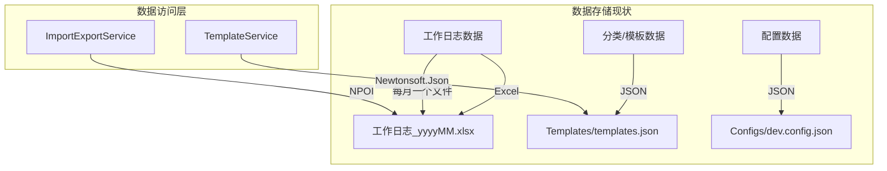
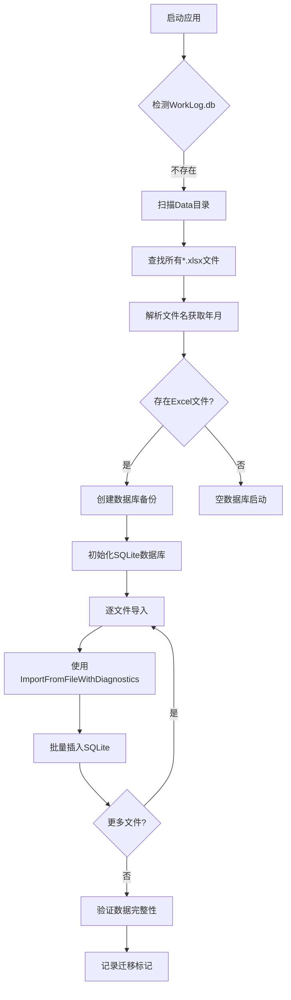
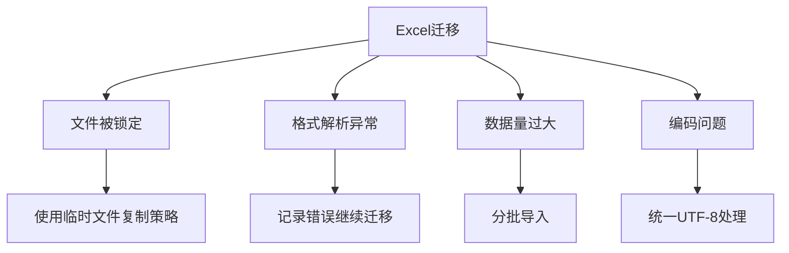

# SQLite 数据库迁移方案 - 技术审查报告

**审查日期**: 2026-03-03  
**审查人**: Architect 模式  
**方案版本**: v1.0  
**项目**: WorkLogApp 桌面应用

---

## 执行摘要

| 审查维度 | 评估 | 风险等级 |
|---------|------|---------|
| 技术可行性 | 通过 | 低 |
| 架构合理性 | 修改后通过 | 中 |
| 数据迁移策略 | **否决** | **严重** |
| 回滚能力 | **否决** | **严重** |
| 技术栈兼容性 | 修改后通过 | 中 |

**综合建议**: **修改后通过** ⚠️  
**关键问题**: 原设计方案错误假设数据存储在 JSON 中，实际上数据存储在 Excel 文件中。必须完全重新设计迁移策略。

---

## 1. 现有架构分析（基于代码审查）

### 1.1 实际数据存储架构



### 1.2 ImportExportService 核心能力分析

| 方法 | 功能 | 关键实现细节 |
|------|------|-------------|
| `ExportMonth()` | 合并导出到 Excel | 读取现有Excel，合并新数据，按周分Sheet |
| `RewriteMonth()` | 完全覆盖整月 | 生成按周分组的多个工作表，中文表头 |
| `ImportMonth()` | 按月导入 | 支持新旧文件名格式兼容 |
| `ImportFromFileWithDiagnostics()` | 带诊断的导入 | 临时文件复制避免文件锁定问题 |

**关键发现**:
- 文件名格式: `工作日志_yyyyMM.xlsx` (新) / `worklog_yyyyMM.xlsx` (旧)
- Sheet 按周分组命名: "d日-d日" 格式
- 表头使用中文字段名 + 英文字段名映射
- 列: 日期、标题、内容、分类、状态、开始时间、结束时间、标签、排序、日志ID、追踪ID
- 每日总结以特殊行格式存储（标题="当日总结"）

### 1.3 数据模型映射

```csharp
// Excel 列 -> WorkLogItem 属性映射
"日期"          -> LogDate (yyyy年MM月dd日)
"标题"          -> ItemTitle
"内容"          -> ItemContent  
"分类"          -> CategoryName (存储名称而非ID)
"状态"          -> Status (中文转枚举)
"开始时间"      -> StartTime (yyyy-MM-dd HH:mm)
"结束时间"      -> EndTime
"标签"          -> Tags
"排序"          -> SortOrder
"日志ID"        -> Id (隐藏列)
"追踪ID"        -> TrackingId (隐藏列)

// 当日总结行特殊处理
标题="当日总结"  -> WorkLog.DailySummary
```

---

## 2. 数据迁移策略审查

### 2.1 原方案缺陷（严重）

**原设计方案严重错误地假设数据存储在 JSON 文件中**，实际上：
- 工作日志数据存储在 **Excel (.xlsx)** 文件中
- 仅有分类/模板数据存储在 JSON 中
- 原方案第5节"数据迁移计划 (JSON to SQLite)"完全不适用

### 2.2 Excel 到 SQLite 迁移的挑战

| 挑战 | 说明 | 风险等级 |
|------|------|---------|
| **文件格式解析** | Excel是二进制格式，非结构化文本 | 高 |
| **多文件聚合** | 每月一个Excel文件，需遍历所有历史文件 | 高 |
| **数据一致性** | Excel格式可能有版本差异（新旧文件名、列名兼容） | 中 |
| **合并单元格** | 日期行使用合并单元格，解析复杂 | 中 |
| **样式数据** | Excel包含样式信息，需区分内容与展示 | 低 |

### 2.3 正确的迁移策略设计

```csharp
public interface IExcelToSQLiteMigrationService
{
    MigrationResult MigrateAllExcelFiles(string dataDirectory);
    MigrationResult MigrateSingleExcelFile(string filePath);
    bool ValidateMigration(MigrationResult result);
    bool RollbackMigration();
}

public class MigrationOptions
{
    public string DataDirectory { get; set; }           // Data/ 目录路径
    public string BackupDirectory { get; set; }         // 备份路径
    public bool DryRun { get; set; }                    // 模拟运行
    public bool KeepExcelFiles { get; set; } = true;   // 保留原Excel
    public Action<string> ProgressCallback { get; set; } // 进度报告
}
```

### 2.4 迁移流程（修正版）



---

## 3. 回滚方案与故障恢复

### 3.1 现有方案缺陷

**原方案完全缺失回滚机制**。考虑到 Excel 到 SQLite 的迁移，风险更高：
- Excel 文件可能被外部程序修改
- 解析过程中可能遇到格式异常
- 多文件迁移中途失败需要部分回滚

### 3.2 建议的回滚架构

```
迁移前必须执行：
1. 完整备份 Data/ 目录 -> Data/Backup/PreSQLite_YYYYMMDD/
2. 创建迁移日志表记录每个Excel文件的处理状态
3. 使用数据库事务包裹每个文件的导入
4. 保留原始Excel文件（不删除）

故障恢复策略：
- Level 1: 事务回滚（单文件导入失败）
- Level 2: 删除.db，恢复备份目录
- Level 3: 重新运行迁移（幂等性设计）
```

### 3.3 迁移状态追踪表

```sql
CREATE TABLE MigrationLog (
    Id INTEGER PRIMARY KEY AUTOINCREMENT,
    FileName TEXT NOT NULL,
    FilePath TEXT NOT NULL,
    FileSize INTEGER,
    Status TEXT NOT NULL, -- Pending/Processing/Completed/Failed
    RecordsImported INTEGER,
    ErrorMessage TEXT,
    StartedAt DATETIME,
    CompletedAt DATETIME
);
```

---

## 4. 数据库设计审查

### 4.1 与原设计的差异

基于对 `ImportExportService` 的代码分析，发现以下设计差异：

| 原设计 | 实际Excel存储 | 建议调整 |
|-------|-------------|---------|
| CategoryName 冗余存储 | 实际存储分类名称 | 保持现状（避免外键约束复杂性） |
| WorkLogs 以 LogDate 为主键 | Excel按日期行分组 | 建议改为自增ID + 唯一索引 |
| 无 TrackingId 处理 | 自动生成未完成项的TrackingId | 需保留此逻辑 |

### 4.2 索引策略（基于查询模式）

根据 `MainForm.cs` 中的使用模式：
- 按月查询: `WHERE LogDate >= 'yyyy-MM-01' AND LogDate < 'yyyy-MM-31'`
- 按状态过滤: `WHERE Status = ?`
- 按分类过滤: `WHERE CategoryName = ?`

```sql
-- 建议索引
CREATE INDEX IX_WorkLogItems_LogDate ON WorkLogItems(LogDate);
CREATE INDEX IX_WorkLogItems_Status ON WorkLogItems(Status);
CREATE INDEX IX_WorkLogItems_CategoryName ON WorkLogItems(CategoryName);
CREATE INDEX IX_WorkLogItems_TrackingId ON WorkLogItems(TrackingId);
```

---

## 5. 技术栈兼容性分析

### 5.1 EF Core 版本限制

| 包 | 推荐版本 | 兼容性 |
|----|---------|-------|
| Microsoft.EntityFrameworkCore.Sqlite | 3.1.32 | 最后一个支持.NET Framework 4.7.2的版本 |

**⚠️ 警告**: EF Core 5.0+ 不支持 .NET Framework，3.1 已于 2022-12-13 结束支持。

### 5.2 替代方案：Dapper

考虑到 EF Core 3.1 的维护状态，建议评估 Dapper：
- 无版本限制
- 性能更优
- 手写SQL更适合复杂查询（如按周分组）

---

## 6. 关键风险与单点故障

### 6.1 识别的关键风险



### 6.2 具体风险场景

| 场景 | 影响 | 缓解措施 |
|------|------|---------|
| Excel文件被WPS/Office锁定 | 无法读取 | 使用现有临时文件复制策略 |
| 日期格式解析失败 | 数据丢失 | 多格式尝试解析（已在代码中实现） |
| 合并单元格导致行识别错误 | 数据错位 | 专用解析逻辑处理日期行 |
| 分类名称变更 | 历史数据不一致 | 保留名称字符串，不做外键约束 |

---

## 7. 与现有代码的集成点

### 7.1 需要修改的服务

| 服务 | 当前实现 | 修改需求 |
|------|---------|---------|
| `ImportExportService` | 直接读写Excel | 修改为读写SQLite，保留Excel导入导出能力 |
| `MainForm` | 调用 `ImportMonth`/`ExportMonth` | 改为调用新的数据访问层 |
| `ItemCreateForm` | 直接调用 `ExportMonth` | 通过服务层间接调用 |

### 7.2 向后兼容性

必须保留的能力：
- Excel 导入功能（用于从旧版本迁移或外部导入）
- Excel 导出功能（用于数据备份和分享）
- TXT/JSON 导入（`ImportFromTxt` 方法已存在）

---

## 8. 实施建议

### 8.1 总体评估

**建议结果**: **修改后通过**  
**置信度**: 60%（因迁移策略需要重大调整）

### 8.2 通过条件（必须满足）

1. **重新设计迁移策略**: 从 Excel 文件导入，而非 JSON
2. **复用现有解析逻辑**: 使用 `ImportFromFileWithDiagnostics` 确保兼容性
3. **完整备份机制**: 迁移前备份整个 Data 目录
4. **迁移状态追踪**: 实现 `MigrationLog` 表记录每个文件的处理状态
5. **保留 Excel 文件**: 迁移后不删除原文件，便于回滚
6. **双模式运行**: 支持 SQLite 主存储 + Excel 导入导出并存

### 8.3 优先级排序的改进清单

| 优先级 | 任务 | 说明 | 预估工作量 |
|-------|------|------|-----------|
| **P0** | 修正迁移策略 | 从Excel而非JSON迁移 | 8h |
| **P0** | 数据备份机制 | 完整备份Data目录 | 4h |
| **P0** | 迁移状态追踪 | MigrationLog表实现 | 6h |
| **P1** | 双模式支持 | SQLite存储+Excel导入导出 | 12h |
| **P1** | 回滚功能 | 一键恢复Excel模式 | 6h |
| **P1** | 数据验证 | 迁移后记录数校验 | 4h |
| **P2** | 主键优化 | WorkLogs改为自增ID | 4h |
| **P2** | 索引优化 | 根据查询模式添加索引 | 2h |
| **P3** | Dapper评估 | 替代EF Core 3.1 | 8h |

### 8.4 建议的实施路线图

```
Phase 1 (Week 1): 基础设施与修正
  - 修正迁移策略设计（Excel源）
  - 添加 EF Core/Dapper 包
  - 实现备份机制和 MigrationLog 表
  - 创建 DbContext 和数据访问层

Phase 2 (Week 2): 迁移引擎
  - 实现 Excel 文件扫描和解析
  - 复用 ImportFromFileWithDiagnostics 逻辑
  - 实现分批导入和状态追踪
  - 集成测试

Phase 3 (Week 3): 双模式与回滚
  - 实现双模式运行（SQLite主存储+Excel导出）
  - 保留 Excel 导入能力（兼容旧数据）
  - 实现回滚功能
  - 数据验证逻辑

Phase 4 (Week 4): UI集成与测试
  - 修改 MainForm 调用新的数据访问层
  - 添加迁移进度UI
  - 端到端测试
  - 生产环境验证
```

---

## 9. 关键代码审查

### 9.1 迁移执行代码（建议）

```csharp
public class ExcelToSQLiteMigrationService
{
    private readonly AppDbContext _dbContext;
    private readonly IImportExportService _importService;
    
    public MigrationResult MigrateAllExcelFiles(string dataDirectory)
    {
        var result = new MigrationResult();
        var excelFiles = Directory.GetFiles(dataDirectory, "*.xlsx")
            .Where(f => Path.GetFileName(f).StartsWith("工作日志_") || 
                        Path.GetFileName(f).StartsWith("worklog_"))
            .OrderBy(f => f); // 按年月顺序处理
        
        foreach (var file in excelFiles)
        {
            var fileResult = MigrateSingleFile(file);
            result.Merge(fileResult);
            
            // 记录到 MigrationLog
            _dbContext.MigrationLogs.Add(new MigrationLog
            {
                FileName = Path.GetFileName(file),
                FilePath = file,
                Status = fileResult.Success ? "Completed" : "Failed",
                RecordsImported = fileResult.RecordsCount,
                ErrorMessage = fileResult.ErrorMessage,
                CompletedAt = DateTime.Now
            });
            _dbContext.SaveChanges();
        }
        
        return result;
    }
    
    private MigrationResult MigrateSingleFile(string filePath)
    {
        // 复用现有解析逻辑
        var importResult = _importService.ImportFromFileWithDiagnostics(filePath);
        
        if (importResult.Data != null)
        {
            foreach (var workLog in importResult.Data)
            {
                _dbContext.WorkLogs.Add(workLog);
            }
            _dbContext.SaveChanges();
        }
        
        return new MigrationResult
        {
            Success = importResult.Errors.Count == 0,
            RecordsCount = importResult.Data?.Sum(d => d.Items.Count) ?? 0,
            ErrorMessage = string.Join("; ", importResult.Errors)
        };
    }
}
```

### 9.2 与现有服务的集成

```csharp
// ImportExportService 需要重构为：
public class ImportExportService : IImportExportService
{
    private readonly AppDbContext _dbContext; // 新增
    private readonly IPdfExportService _pdfExportService;
    
    // 保留现有的 Excel 导出能力用于备份/分享
    public bool ExportMonthToExcel(DateTime month, string outputDirectory) { ... }
    
    // 新增：从SQLite查询并导出
    public bool ExportMonth(DateTime month, IEnumerable<WorkLog> days, string outputDirectory)
    {
        // 1. 保存到 SQLite
        SaveToSQLite(days);
        
        // 2. 可选：同时导出到 Excel（备份）
        ExportMonthToExcel(month, outputDirectory);
        
        return true;
    }
    
    // 新增：从SQLite读取
    public IEnumerable<WorkLog> ImportMonth(DateTime month)
    {
        return _dbContext.WorkLogs
            .Include(w => w.Items)
            .Where(w => w.LogDate.Year == month.Year && w.LogDate.Month == month.Month)
            .ToList();
    }
}
```

---

## 10. 总结

SQLite 迁移方案**技术上可行**，但原设计方案存在**严重误解**——错误假设数据存储在 JSON 中，实际上数据存储在 Excel 文件中。

### 核心修正点：
1. **迁移源**: 从 Excel 文件而非 JSON
2. **迁移逻辑**: 复用 `ImportFromFileWithDiagnostics` 确保格式兼容性
3. **双模式**: 保留 Excel 导入导出能力（向后兼容和备份需求）
4. **回滚**: 保留原始 Excel 文件作为回滚基础

建议在完成 P0 级别改进后分阶段实施。

---

*报告完成 - 2026-03-03*  
*基于对 WorkLogApp.Services/Implementations/ImportExportService.cs 的代码审查*
