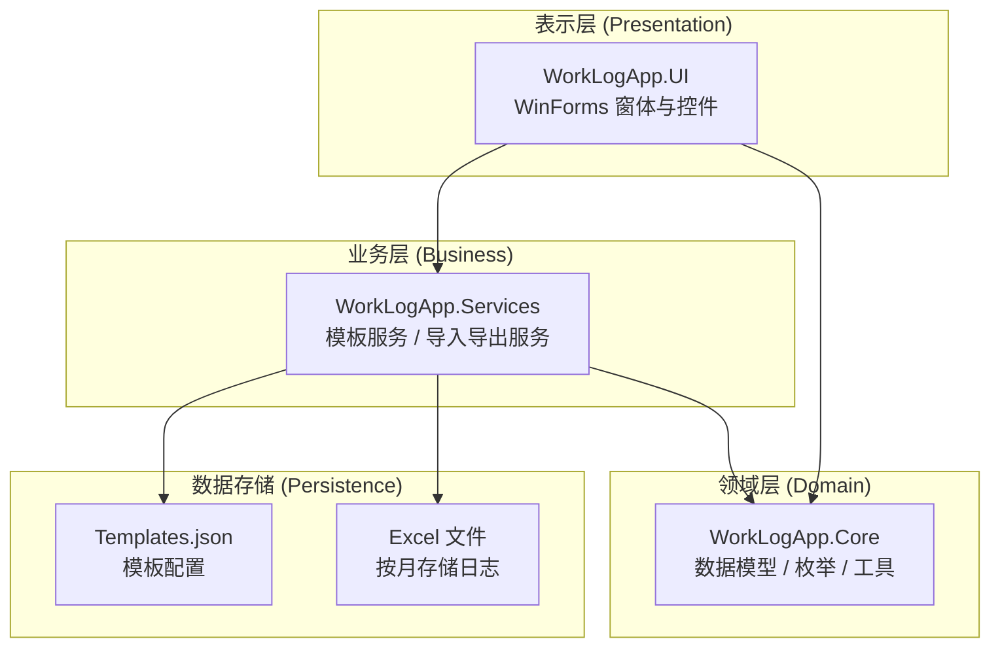

# 工作日志桌面应用全面分析报告与改进路线图

**报告日期**：2025年12月23日  
**分析模式**：终端用户视角 + 系统架构师视角  
**当前版本**：.NET Framework 4.7.2 WinForms

---

## 执行摘要

通过对代码库的深入分析，识别出 **12项用户体验改进点** 和 **10项架构优化机会**。综合评估后，制定了 **高、中、低三个优先级** 的改进路线图，兼顾对用户的即时价值与长期代码健康性。

---

## 一、当前架构概览

### 1.1 现有分层架构

### 1.2 关键模块职责

| 模块 | 职责 | 关键类 |
|------|------|--------|
| `MainForm` | 主界面，日志列表展示与操作 | `MainForm.cs` |
| `CategoryManageForm` | 分类与模板管理 | `CategoryManageForm.cs` |
| `ItemCreateForm` | 模板驱动创建日志 | `ItemCreateForm.cs` |
| `ItemEditForm` | 纯文本编辑与进展追踪 | `ItemEditForm.cs` |
| `TemplateService` | 模板加载、保存、渲染 | `TemplateService.cs` |
| `ImportExportService` | Excel 读写、导入导出 | `ImportExportService.cs` |
| `UIStyleManager` | 统一界面风格与缩放 | `UIStyleManager.cs` |

---

## 二、用户体验改进点 (终端用户视角)

### 2.1 清晰度与直观性

| 问题描述 | 影响程度 | 改进建议 |
|----------|----------|----------|
| 主界面列表信息过载，列过多 | 中 | 隐藏不常用列（如日志ID），提供列显示自定义选项 |
| 日/月视图切换仅靠复选框，缺乏视觉提示 | 低 | 添加视图模式指示器（图标 + 文字） |
| 分类管理界面中，模板编辑器的占位符表格操作不够直观 | 中 | 增加占位符类型图标，提供拖拽排序 |
| 动态表单生成器布局单调，缺乏视觉分组 | 低 | 使用分组面板（GroupBox）区分不同部分 |

### 2.2 可访问性与响应速度

| 问题描述 | 影响程度 | 改进建议 |
|----------|----------|----------|
| 无键盘快捷键支持 | 低 | 添加常用操作的快捷键（如 Ctrl+N 新建） |
| 高DPI下字体缩放可能不协调 | 中 | 优化 `UIStyleManager` 的 DPI 感知逻辑 |
| Excel 读写操作阻塞 UI 线程 | 高 | 使用 `async/await` 异步执行 IO 操作 |
| 导入大量数据时无进度反馈 | 中 | 添加进度条和取消按钮 |

### 2.3 功能流程与反馈

| 问题描述 | 影响程度 | 改进建议 |
|----------|----------|----------|
| 创建事项时，若分类无模板会弹出警告，但用户可能困惑 | 中 | 改为提示信息，并提供“创建空模板”选项 |
| 编辑事项时，根据状态切换 UI 控件（时间选择器 vs 每日进展）可能让用户迷惑 | 高 | 优化状态切换的过渡动画，提供帮助提示 |
| 自动继承功能（复制前一日事项）无任何通知 | 中 | 在界面上显示“已自动继承 X 项”，并提供撤销选项 |
| 错误消息过于技术化 | 低 | 将异常消息转换为用户友好的描述 |

### 2.4 数据可视化与搜索

| 问题描述 | 影响程度 | 改进建议 |
|----------|----------|----------|
| 缺乏统计视图（如月度工时分布、完成率） | 中 | 添加侧边栏统计面板，支持简单图表 |
| 无法快速筛选或搜索日志项 | 高 | 在主界面添加搜索框和状态筛选器 |
| 无法导出为 PDF 或 Word | 低 | 集成第三方库（如 QuestPDF）支持 PDF 导出 |

---

## 三、架构改进潜力 (系统架构师视角)

### 3.1 代码结构与可维护性

| 问题描述 | 影响程度 | 改进建议 |
|----------|----------|----------|
| 紧耦合：UI 直接实例化服务实现 | 高 | 引入依赖注入容器（如 SimpleInjector） |
| 过时的 JSON 序列化库（JavaScriptSerializer） | 中 | 升级为 Newtonsoft.Json 或 System.Text.Json |
| 长方法（如 `ParseSheet` 超过 200 行） | 中 | 按单一职责拆分为多个小方法 |
| 硬编码字符串（列名、文件路径） | 低 | 提取为常量或配置类 |

### 3.2 可测试性与扩展性

| 问题描述 | 影响程度 | 改进建议 |
|----------|----------|----------|
| 单元测试覆盖率低，难以模拟依赖 | 高 | 重构服务接口，增加单元测试项目 |
| 模板系统添加新占位符类型需修改多处代码 | 中 | 使用插件模式，通过配置注册新类型 |
| 导入导出仅支持 Excel，添加新格式困难 | 中 | 定义 `IStorageProvider` 接口，支持多种存储后端 |
| 分类树形结构移动逻辑缺乏完整循环引用检测 | 低 | 实现图算法检测循环引用 |

### 3.3 技术债务与安全性

| 问题描述 | 影响程度 | 改进建议 |
|----------|----------|----------|
| .NET Framework 4.7.2 限制跨平台能力 | 中 | 制定迁移到 .NET 6+ 的路线图 |
| 缺乏输入验证，可能存在路径遍历漏洞 | 高 | 对用户输入进行严格验证和清理 |
| 日志文件可能被恶意锁定导致写入失败 | 中 | 实现文件锁重试机制和备份写入 |
| 配置管理简单，无法动态更新 | 低 | 使用 `IConfiguration` 体系支持热重载 |

---

## 四、优先级排序的可执行建议

### 4.1 高优先级（高影响力、快速见效）

| 序号 | 建议 | 预期收益 | 预估工作量 |
|------|------|----------|------------|
| H1 | 主界面添加搜索框和状态筛选器 | 提升用户查找效率 50% | 2-3 人天 |
| H2 | Excel 读写异步化，避免 UI 冻结 | 改善用户感知性能 | 3-4 人天 |
| H3 | 错误消息友好化，增加操作进度提示 | 减少用户困惑 | 1-2 人天 |
| H4 | 输入验证与路径遍历防护 | 提升安全性 | 1 人天 |
| H5 | 引入依赖注入容器，提升可测试性 | 为后续重构奠定基础 | 3-5 人天 |

### 4.2 中优先级（提升可维护性和扩展性）

| 序号 | 建议 | 预期收益 | 预估工作量 |
|------|------|----------|------------|
| M1 | 升级 JSON 序列化库为 Newtonsoft.Json | 提高序列化性能与兼容性 | 2 人天 |
| M2 | 重构导入导出服务，分离读写职责 | 降低代码复杂度 | 4-6 人天 |
| M3 | 添加侧边栏统计面板（工时图表） | 增强数据洞察力 | 5-7 人天 |
| M4 | 模板系统插件化，支持新占位符类型 | 提高系统扩展性 | 6-8 人天 |
| M5 | 优化 UIStyleManager 的 DPI 处理逻辑 | 改善高分辨率显示器体验 | 2-3 人天 |

### 4.3 低优先级（长期重构与战略升级）

| 序号 | 建议 | 预期收益 | 预估工作量 |
|------|------|----------|------------|
| L1 | 迁移到 .NET 6+，实现跨平台支持 | 扩大用户群体，利用现代 API | 15-20 人天 |
| L2 | 引入 SQLite 作为可选存储后端 | 提升查询性能与数据一致性 | 10-12 人天 |
| L3 | 实现多语言支持（中英文切换） | 适应国际化需求 | 8-10 人天 |
| L4 | 设计插件架构，支持第三方扩展 | 构建生态系统 | 12-15 人天 |
| L5 | 全面重构 UI 层，考虑 WPF/Avalonia | 提供更丰富的交互体验 | 20-30 人天 |

---

## 五、改进路线图（建议分三个阶段）

### 阶段一：用户体验强化（1-2个月）
1. 实施高优先级建议 H1-H5。
2. 同步进行中优先级 M1、M5。
3. **交付成果**：更流畅、安全、易用的版本 2.0。

### 阶段二：架构现代化（2-3个月）
1. 实施中优先级建议 M2-M4。
2. 开始低优先级 L1 的可行性研究。
3. **交付成果**：可测试、易扩展的版本 3.0。

### 阶段三：战略升级（3-6个月）
1. 实施低优先级建议 L1-L5（根据资源情况选择）。
2. **交付成果**：跨平台、支持多存储的版本 4.0。

---

## 六、详细实施步骤（以 H1 为例）

### 6.1 主界面搜索与筛选功能

1. **修改 `MainForm.Designer.cs`**：
   - 添加 `TextBox` 搜索框和 `ComboBox` 状态筛选器。
   - 调整布局，确保控件对齐。

2. **扩展 `BindListView` 方法**：
   - 增加过滤逻辑，根据搜索词和选定状态过滤 `_currentItems`。
   - 实现实时过滤（`TextChanged` 事件）。

3. **添加辅助方法**：
   - `FilterItems(string searchText, StatusEnum? status)`。
   - 支持标题、内容、标签的多字段搜索。

4. **更新 `RefreshItems` 调用**：
   - 在数据加载后自动应用当前筛选条件。

5. **编写单元测试**：
   - 验证过滤逻辑的正确性。

---

## 七、风险与缓解措施

| 风险 | 可能性 | 影响 | 缓解措施 |
|------|--------|------|----------|
| 异步改造引入线程安全问题 | 中 | 高 | 充分测试，使用 `lock` 保护共享资源 |
| 依赖注入容器增加启动复杂度 | 低 | 中 | 选择轻量级容器（如 SimpleInjector），提供详细文档 |
| 迁移 .NET 6+ 导致兼容性问题 | 中 | 高 | 先创建并行项目，逐步迁移，保留回滚方案 |
| 用户对新界面布局不适应 | 低 | 低 | 提供过渡引导和设置选项恢复旧布局 |

---

## 八、结论与下一步行动

本报告提供了从双重视角分析的全面改进方案。**建议立即开始阶段一的实施**，优先解决用户体验痛点和技术债务。

**下一步行动**：
1. 评审本报告，确认优先级排序。
2. 切换到 **Code 模式** 开始实施高优先级任务。
3. 定期回顾进度，调整路线图。

---
*报告生成者：Roo (AI 架构师)*  
*生成时间：2025-12-23 15:52 (UTC+8)*