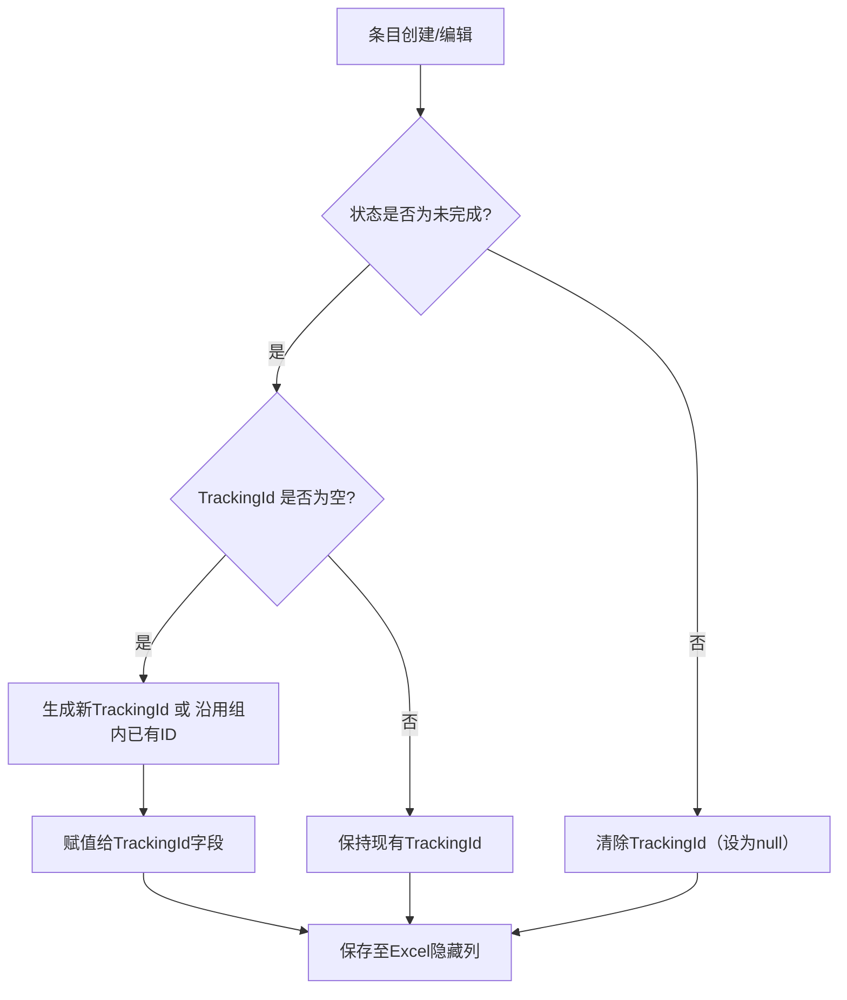

# 日志追踪机制设计方案

## 1. 概述
为满足“同一组相关条目共享一个追踪ID，用于关联和追踪未完成条目”的需求，本设计在现有工作日志应用的基础上引入追踪ID机制。该机制完全内部管理，不暴露给用户界面，通过Excel隐藏列持久化存储。

## 2. 设计目标
- **唯一性**：每个追踪ID全局唯一（采用GUID）。
- **共享性**：同一组相关条目共享同一追踪ID。
- **状态感知**：仅未完成状态（目前为`Doing`，可扩展至`Todo`、`Blocked`）的条目持有追踪ID；当状态变为完成（`Done`、`Cancelled`）时自动清除。
- **持久化**：追踪ID随条目一起存储于Excel文件的隐藏列中。
- **向后兼容**：现有Excel文件无追踪ID列时，导入后字段为`null`，不影响原有功能。

## 3. 数据模型变更

### 3.1 修改 `WorkLogItem` 类
在 `WorkLogApp.Core/Models/WorkLogItem.cs` 中添加一个可空字符串属性：

```csharp
public string TrackingId { get; set; }
```

**说明**：
- 该字段默认为 `null`。
- 仅当条目处于未完成状态且需要与同组条目关联时才被赋值。
- 状态变为完成时，业务逻辑应将其置为 `null`。

### 3.2 状态定义辅助方法
在 `StatusHelper` 中添加判断“未完成状态”的静态方法：

```csharp
public static bool IsIncomplete(StatusEnum status)
{
    return status == StatusEnum.Todo || status == StatusEnum.Doing || status == StatusEnum.Blocked;
}
```

（当前仅关注 `Doing`，但方法预留扩展性。）

## 4. Excel存储变更

### 4.1 表头扩展
修改 `ImportExportService` 中的表头数组，增加第11列（索引10）：

**英文表头**（`Header`）：
```csharp
private static readonly string[] Header = new[]
{
    "LogDate", "ItemTitle", "ItemContent", "CategoryName", "Status",
    "StartTime", "EndTime", "Tags", "SortOrder", "Id", "TrackingId"
};
```

**中文表头**（`HeaderZh`）：
```csharp
private static readonly string[] HeaderZh = new[]
{
    "日期", "标题", "内容", "分类", "状态",
    "开始时间", "结束时间", "标签", "排序", "日志ID", "追踪ID"
};
```

### 4.2 表头映射
在 `HeaderNameMap` 中添加映射：
```csharp
{"追踪ID", "TrackingId"},
{"TrackingId", "TrackingId"}  // 可选，提高英文文件兼容性
```

### 4.3 写入逻辑（WriteSheet）
1. **表头行**：循环 `HeaderZh.Length` 自动绘制。
2. **数据行**：在现有代码设置各列值的区块后，增加对第10列（索引10）的赋值：
   ```csharp
   row.GetCell(10).SetCellValue(item.TrackingId ?? string.Empty);
   row.GetCell(10).CellStyle = blockStyle; // 沿用当前块的样式
   ```
3. **总结行**：追踪ID列留空。
4. **列宽与隐藏**：
   - 设置第10列宽度（例如 `30 * 256`）。
   - 调用 `sheet.SetColumnHidden(10, true)` 使其隐藏（与“日志ID”列相同）。

### 4.4 读取逻辑（ParseSheet）
1. 在 `GetHeaderIndexes` 中自动识别“追踪ID”列。
2. 解析行时，读取该列的值并赋值给 `item.TrackingId`：
   ```csharp
   var trackingIdStr = GetValue(row, indexes, "TrackingId");
   if (!string.IsNullOrWhiteSpace(trackingIdStr))
   {
       item.TrackingId = trackingIdStr;
   }
   ```

## 5. 业务逻辑设计

### 5.1 追踪ID生成
提供静态工具方法生成唯一ID：
```csharp
public static string GenerateTrackingId()
{
    return Guid.NewGuid().ToString();
}
```

### 5.2 分配与关联
- **单个条目分配**：若条目处于未完成状态且 `TrackingId` 为空，可调用 `GenerateTrackingId` 赋值。
- **组分配**：提供方法将同一追踪ID赋值给多个条目（调用方决定分组逻辑）：
  ```csharp
  public void AssignTrackingIdToGroup(IEnumerable<WorkLogItem> items, string trackingId)
  {
      foreach (var item in items)
      {
          item.TrackingId = trackingId;
      }
  }
  ```

### 5.3 状态变更清除
当条目状态从未完成变为完成时，自动清除其 `TrackingId`。建议在状态变更的入口处（如UI保存、服务更新）调用以下方法：
```csharp
public void UpdateStatus(WorkLogItem item, StatusEnum newStatus)
{
    var wasIncomplete = StatusHelper.IsIncomplete(item.Status);
    var nowIncomplete = StatusHelper.IsIncomplete(newStatus);
    item.Status = newStatus;
    if (wasIncomplete && !nowIncomplete)
    {
        // 从未完成 → 完成，清除追踪ID
        item.TrackingId = null;
    }
}
```

### 5.4 查询功能
提供按追踪ID查找条目的方法（可在服务层实现）：
```csharp
public IEnumerable<WorkLogItem> GetItemsByTrackingId(string trackingId)
{
    // 遍历当前内存中的日志数据或从Excel重新导入
}
```

## 6. 服务接口设计
新增 `ITrackingService` 接口，定义上述核心操作：
```csharp
public interface ITrackingService
{
    string GenerateTrackingId();
    void AssignTrackingId(WorkLogItem item, string trackingId);
    void AssignTrackingIdToGroup(IEnumerable<WorkLogItem> items, string trackingId);
    void ClearTrackingIdOnCompletion(WorkLogItem item);
    IEnumerable<WorkLogItem> GetItemsByTrackingId(string trackingId);
}
```

实现类 `TrackingService` 放置于 `WorkLogApp.Services/Implementations/`。

## 7. 集成点与修改清单

### 7.1 修改的文件
1. **数据模型**：
   - `WorkLogApp.Core/Models/WorkLogItem.cs`（添加属性）
2. **状态帮助器**：
   - `WorkLogApp.Core/Helpers/StatusHelper.cs`（添加 `IsIncomplete` 方法）
3. **Excel导入导出服务**：
   - `WorkLogApp.Services/Implementations/ImportExportService.cs`
     - 扩展表头数组与映射
     - 修改 `WriteSheet` 中的列赋值、样式与隐藏
     - 修改 `ParseSheet` 中的读取逻辑
4. **新服务（可选）**：
   - `WorkLogApp.Services/Interfaces/ITrackingService.cs`
   - `WorkLogApp.Services/Implementations/TrackingService.cs`
5. **UI层状态变更点**（如需自动清除）：
   - `WorkLogApp.UI/Forms/ItemEditForm.cs`（保存时调用状态更新）
   - `WorkLogApp.UI/Forms/MainForm.cs`（直接状态修改处）

### 7.2 集成顺序
1. 修改数据模型。
2. 扩展 `ImportExportService` 并验证导入导出功能。
3. 实现业务逻辑辅助方法。
4. 在UI状态变更处集成清除逻辑（若需要）。
5. 编写单元测试（可选）。

## 8. 测试方案
- **单元测试**：针对 `StatusHelper.IsIncomplete`、`GenerateTrackingId`、`UpdateStatus` 等纯逻辑。
- **集成测试**：创建包含追踪ID的Excel文件，验证导入后字段正确解析，导出后列隐藏且值保留。
- **兼容性测试**：使用旧版Excel文件导入，确认不报错且 `TrackingId` 为 `null`。

## 9. 迁移与兼容性考虑
- **向后兼容**：旧文件无“追踪ID”列，导入时该字段为 `null`，导出时新列被添加（空值）。
- **向前兼容**：新文件被旧版本程序打开时，隐藏列会被忽略（NPOI 兼容额外列）。
- **数据迁移**：无需特殊迁移，首次导出后自动补齐列。

## 10. 根据反馈调整的设计细节

### 10.1 自动继承追踪ID
修改 `MainForm.CheckAndInheritItems` 方法，使新复制的条目继承原条目的追踪ID：
- 若原条目 (`prevItem`) 已有 `TrackingId`，则新条目直接复制该值。
- 若原条目无 `TrackingId`，则生成一个新的 `TrackingId` 并同时赋值给原条目与新条目（确保后续继承一致性）。

**代码调整示例**：
```csharp
// 在复制条目时添加
var newItem = new WorkLogItem
{
    // ... 其他字段
    TrackingId = prevItem.TrackingId ?? GenerateTrackingId()
};
if (string.IsNullOrEmpty(prevItem.TrackingId))
{
    prevItem.TrackingId = newItem.TrackingId; // 更新原条目，需持久化
}
```

### 10.2 基于追踪ID的串联总结
修改 `ItemEditForm.TraceBackAndMergeProgress` 方法，将匹配依据从“标题相同”改为“追踪ID相同”：
- 通过 `TrackingId` 查找所有相关条目（包括已完成与未完成）。
- 按日期正序提取进展块，生成“项目全周期进展汇总”。
- 保留原有汇总逻辑，仅替换匹配算法。

**优势**：
- 标题变更不影响关联。
- 可准确串联跨多日的同一任务线。

### 10.3 先收集总结再状态改变
现有 `OnCompleteClick` 已实现“先追加当日进展 → 执行追溯汇总 → 标记为完成”的顺序，符合“先收集总结再状态改变”的要求。无需调整。

### 10.4 集成影响
- **`ImportExportService`**：无需额外修改，已支持 `TrackingId` 列的读写。
- **`ItemEditForm`**：`TraceBackAndMergeProgress` 方法需增加按 `TrackingId` 查询的逻辑（可调用新增的 `GetItemsByTrackingId` 服务）。
- **`MainForm`**：`CheckAndInheritItems` 方法需处理 `TrackingId` 的继承与回写。

## 11. 迁移机制

### 11.1 目标
为旧版Excel文件（无“追踪ID”列）中的未完成条目自动生成追踪ID，确保历史数据具备可追踪性。

### 11.2 触发时机
- **导入时**：在 `ImportExportService.ParseSheet` 中，若检测到某行的 `TrackingId` 列为空且条目状态为未完成，则自动生成并赋值。
- **启动时**（可选）：遍历 `Data` 目录下所有月份文件，执行一次性批量迁移（需谨慎，避免重复生成）。

### 11.3 实现方案
#### 方案A：导入时即时修补
```csharp
// 在 ParseSheet 解析每个条目后添加
if (string.IsNullOrEmpty(item.TrackingId) && StatusHelper.IsIncomplete(item.Status))
{
    item.TrackingId = GenerateTrackingId();
    // 标记需要回写（可在导出时统一持久化）
}
```
**优点**：按需生成，无额外开销。
**缺点**：仅当该文件再次被导出时才会写入磁盘（用户执行保存操作）。

#### 方案B：独立迁移命令
提供菜单命令“迁移旧数据”，调用 `MigrationService.MigrateLegacyFiles(string dataDir)`，遍历所有文件，为未完成条目生成追踪ID并直接写回原文件。

**优点**：一次性完成，持久化立即生效。
**缺点**：需要用户手动触发。

### 11.4 推荐方案
采用**方案A（导入时即时修补）**，因为：
1. 无需用户干预，体验平滑。
2. 结合日常保存操作自然持久化，避免额外复杂度。
3. 符合“智能”迁移的要求。

### 11.5 注意事项
- 仅对未完成状态（`Doing`、`Todo`、`Blocked`）生成ID，已完成条目保持 `null`。
- 同一组条目（如通过继承产生的多个条目）在迁移后应共享同一追踪ID？这需要更复杂的逻辑，建议在首次生成时统一分配，后续继承逻辑会保证共享。
- 避免重复生成：若条目已存在追踪ID（例如部分文件已有新列），则跳过。

## 12. 流程图



## 11. 后续扩展建议
- **UI显示**：未来可在条目列表或编辑窗口中显示追踪ID，方便用户查看关联关系。
- **分组管理**：提供界面手动将多个条目绑定到同一追踪ID。
- **追踪报告**：按追踪ID生成跨日期的任务进展报告。

---
*设计完成时间：2025-12-25*
*设计者：Roo（架构模式）*