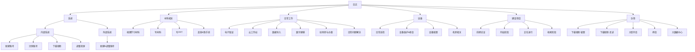

# 工作日志模板系统改进建议

## 一、当前模板使用现状分析

### 1.1 数据结构概览



### 1.2 模板填充率统计

| 状态 | 数量 | 占比 | 示例 |
|------|------|------|------|
| 有完整内容 | 9个 | 39% | 调整投屏、日常问题解决、开会、大数据中心 |
| 仅有基础字段 | 4个 | 17% | 新建账号、电子取证、正在进行、下载视频-留置 |
| 完全为空 | 10个 | 44% | 注销账号、下载视频、写材料、写PPT等 |

### 1.3 当前字段类型使用情况

```json
{
  "已使用字段类型": {
    "text": "文本输入 - 系统名称、账号信息、地点等",
    "textarea": "多行文本 - 详细描述、进度汇报等",
    "datetime": "日期时间 - 起始时间、结束时间等",
    "select": "下拉选择 - 是否影响区市等",
    "checkbox": "多选框 - 是否来自案管、是否由案管发来等"
  }
}
```

---

## 二、程序架构层面的改进建议

### 2.1 数据模型扩展

#### 2.1.1 增强 WorkTemplate 模型

```csharp
public class WorkTemplate
{
    // 现有字段
    public string Id { get; set; }
    public string Name { get; set; }
    public string CategoryId { get; set; }
    public string Content { get; set; }
    public List<string> Tags { get; set; }
    
    // 建议新增：字段定义升级为结构化对象
    public List<TemplateField> Fields { get; set; }
    
    // 建议新增：模板元数据
    public TemplateMetadata Metadata { get; set; }
    
    // 建议新增：模板版本控制
    public string Version { get; set; }
    public DateTime LastModified { get; set; }
}

public class TemplateField
{
    public string Name { get; set; }           // 字段名称（中文）
    public string Key { get; set; }            // 字段标识（英文，用于替换）
    public string Type { get; set; }           // 字段类型
    public string DefaultValue { get; set; }   // 默认值
    public bool IsRequired { get; set; }       // 是否必填
    public string ValidationRule { get; set; } // 验证规则（正则）
    public string Placeholder { get; set; }    // 输入提示
    public int Order { get; set; }             // 显示顺序
    public FieldCondition Condition { get; set; } // 条件显示
    public List<string> Options { get; set; }  // 选项（用于select/checkbox）
}

public class FieldCondition
{
    public string DependsOn { get; set; }      // 依赖字段
    public string Operator { get; set; }       // 操作符：eq/ne/in/contains
    public string Value { get; set; }          // 比较值
}

public class TemplateMetadata
{
    public string Description { get; set; }    // 模板描述
    public string Author { get; set; }         // 创建者
    public List<string> UsageScenarios { get; set; } // 适用场景
    public int UsageCount { get; set; }        // 使用次数统计
}
```

#### 2.1.2 新增字段类型支持

```csharp
public enum FieldType
{
    // 基础类型
    Text,           // 单行文本
    TextArea,       // 多行文本
    Number,         // 数字
    DateTime,       // 日期时间
    Date,           // 仅日期
    Time,           // 仅时间
    
    // 选择类型
    Select,         // 单选下拉
    MultiSelect,    // 多选下拉
    Checkbox,       // 多选框
    Radio,          // 单选框
    
    // 特殊类型
    AutoComplete,   // 自动补全（历史输入记忆）
    Duration,       // 时长选择（如：2小时30分钟）
    RangeDateTime,  // 时间范围（起止时间一体）
    Person,         // 人员选择（可关联通讯录）
    Department,     // 部门选择
    SystemName,     // 系统名称（下拉+记忆）
    RoomNumber,     // 房间号（特定格式）
    PhoneNumber,    // 电话号码
    
    // 复合类型
    ListInput,      // 列表输入（动态增减行）
    KeyValuePair,   // 键值对输入
    
    // 计算类型
    Formula         // 公式计算（如：自动计算时长）
}
```

### 2.2 DynamicFormPanel 控件增强

#### 2.2.1 新增控件渲染逻辑

```csharp
public class DynamicFormPanel : Panel
{
    // 现有方法保持不变...
    
    // 新增：支持字段分组
    public void BuildForm(List<FieldGroup> groups)
    {
        // 按分组渲染，每组可以有标题和展开/收起功能
    }
    
    // 新增：支持字段联动
    private void SetupFieldDependencies(TemplateField field)
    {
        // 当条件字段值变化时，显示/隐藏或启用/禁用依赖字段
    }
    
    // 新增：字段验证
    public ValidationResult Validate()
    {
        // 根据字段的 ValidationRule 进行验证
        // 返回验证错误列表
    }
    
    // 新增：自动填充历史数据
    public void EnableAutoComplete(string fieldKey, IEnumerable<string> historyValues)
    {
        // 为字段启用自动补全功能
    }
}
```

#### 2.2.2 建议新增控件类型

| 控件 | 用途 | 实现建议 |
|------|------|----------|
| `DurationPicker` | 时长选择 | 小时+分钟双选或滑块 |
| `RangeDateTimePicker` | 起止时间 | 两个时间选择器联动，自动计算时长 |
| `AutoCompleteTextBox` | 自动补全 | 继承TextBox，添加下拉建议列表 |
| `ListInputControl` | 动态列表 | 可添加/删除行的列表输入 |
| `PersonSelector` | 人员选择 | 下拉+搜索，支持多选 |

### 2.3 TemplateService 增强

#### 2.3.1 智能内容渲染

```csharp
public string Render(WorkTemplate template, Dictionary<string, object> values, WorkLogItem item)
{
    var result = template.Content;
    
    // 现有：基础字段替换
    result = ReplaceBasicFields(result, values);
    
    // 新增：条件内容块
    // 支持语法：{条件?内容A:内容B}
    result = ReplaceConditionalBlocks(result, values);
    
    // 新增：列表渲染
    // 支持语法：{列表字段@模板}
    result = ReplaceListFields(result, values);
    
    // 新增：函数调用
    // 支持语法：{字段|函数名}
    result = ApplyFunctions(result, values);
    
    return result;
}

// 示例函数
private string ApplyFunctions(string content, Dictionary<string, object> values)
{
    // {起始时间|duration:结束时间} -> 计算时长
    // {地点|trim} -> 去除空白
    // {内容|lines} -> 转换为多行格式
    // {时间|relative} -> 转换为相对时间描述
}
```

#### 2.3.2 模板继承与组合

```csharp
public class TemplateInheritance
{
    // 支持模板继承
    public string BaseTemplateId { get; set; }
    
    // 支持模板片段（可复用的内容块）
    public List<string> IncludeFragments { get; set; }
}

// 示例：基础模板"会议记录"，子模板"例会"、"大型开会"继承基础模板
```

### 2.4 新增功能模块

#### 2.4.1 模板分析统计服务

```csharp
public interface ITemplateAnalyticsService
{
    // 统计模板使用频率
    Dictionary<string, int> GetUsageStatistics(DateTime from, DateTime to);
    
    // 分析字段填写率
    Dictionary<string, double> GetFieldCompletionRate(string templateId);
    
    // 获取常用字段值（用于自动补全）
    List<string> GetCommonValues(string fieldKey, int topN = 10);
    
    // 推荐模板（基于历史使用模式）
    List<WorkTemplate> GetRecommendedTemplates(WorkLogItem context);
}
```

#### 2.4.2 模板导入导出

```csharp
public interface ITemplateImportExportService
{
    // 导出模板为JSON/YAML
    string ExportTemplate(string templateId, ExportFormat format);
    
    // 批量导入模板
    ImportResult ImportTemplates(string content, ImportOptions options);
    
    // 模板备份与恢复
    void BackupTemplates(string backupPath);
    void RestoreTemplates(string backupPath);
}
```

---

## 三、模板设计层面的改进建议

### 3.1 分类结构优化

#### 3.1.1 当前问题

1. **分类层级过深**：某些分类路径过长（日志 > 系统 > 内部系统 > XXX）
2. **分类命名不一致**：有些用动词（"下载视频"），有些用名词（"日常巡检"）
3. **重复分类**："下载视频"同时存在于"内部系统"和根级别的"下载视频（留置）/（走读）"
4. **空模板过多**：44%的模板没有定义任何字段

#### 3.1.2 优化建议

```
建议分类结构：

📁 系统运维
  ├── 📝 账号管理（合并新建/调整/注销）
  ├── 📝 权限变更
  ├── 📝 系统配置
  └── 📝 投屏调整

📁 视频管理
  ├── 📝 留置视频下载
  ├── 📝 走读视频下载
  └── 📝 视频维护

📁 案件支持
  ├── 📝 电子取证
  ├── 📝 数据导入
  ├── 📝 数字建模
  └── 📝 驻场支持

📁 文档工作
  ├── 📝 材料撰写
  ├── 📝 PPT制作
  ├── 📝 学习梳理
  └── 📝 盖章手续

📁 会议活动
  ├── 📝 例会
  ├── 📝 大型会议
  └── 📝 培训学习

📁 设备运维
  ├── 📝 日常巡检
  ├── 📝 设备维护
  ├── 📝 机房管理
  └── 📝 故障处理

📁 项目建设
  ├── 📝 前期论证
  ├── 📝 项目启动
  ├── 📝 项目进行中
  └── 📝 项目收尾

📁 数据服务
  └── 📝 大数据中心导入

📁 其他
  ├── 📝 日常问题处理
  └── 📝 杂项记录
```

### 3.2 具体模板改进方案

#### 3.2.1 账号管理模板（合并版）

**现状问题**：
- 新建账号、调整账号、注销账号分散在不同分类
- 字段定义不一致
- 有些字段在内容中未被使用

**改进方案**：

```json
{
  "Name": "账号管理",
  "Content": "{操作类型}【{系统名称}】系统账号\n\n【账号信息】\n{账号列表}\n\n【操作详情】\n{操作详情}\n\n【影响范围】\n{影响范围}\n\n{备注信息}",
  "Fields": [
    {
      "Key": "operationType",
      "Name": "操作类型",
      "Type": "radio",
      "Options": ["新建", "调整权限", "注销", "重置密码"],
      "IsRequired": true
    },
    {
      "Key": "systemName",
      "Name": "系统名称",
      "Type": "autocomplete",
      "Placeholder": "输入系统名称，支持自动补全",
      "IsRequired": true
    },
    {
      "Key": "accountList",
      "Name": "账号信息",
      "Type": "listInput",
      "Placeholder": "每行一个账号，格式：姓名-账号-权限",
      "IsRequired": true
    },
    {
      "Key": "operationDetail",
      "Name": "操作详情",
      "Type": "textarea",
      "Placeholder": "描述具体操作内容..."
    },
    {
      "Key": "affectScope",
      "Name": "影响范围",
      "Type": "select",
      "Options": ["仅本部门", "影响部分区市", "影响全部区市"],
      "DefaultValue": "仅本部门"
    },
    {
      "Key": "fromCaseMgmt",
      "Name": "是否来自案管",
      "Type": "checkbox",
      "Options": ["案管通知"],
      "Condition": {
        "DependsOn": "operationType",
        "Operator": "in",
        "Value": "新建,调整权限"
      }
    },
    {
      "Key": "remarks",
      "Name": "备注",
      "Type": "textarea",
      "Placeholder": "其他需要说明的信息..."
    }
  ]
}
```

#### 3.2.2 视频下载模板（留置+走读统一）

**现状问题**：
- 留置和走读分开，但字段高度相似
- 缺少时长计算
- 缺少申请人信息

**改进方案**：

```json
{
  "Name": "视频下载",
  "Content": "【{videoType}视频下载】\n\n申请人：{dept} - {applicant}\n时间范围：{startTime:yyyy-MM-dd HH:mm} 至 {endTime:yyyy-MM-dd HH:mm}\n{duration|durationFormat}\n房间/地点：{location}\n\n【用途说明】\n{purpose}\n\n【下载情况】\n{downloadStatus}",
  "Fields": [
    {
      "Key": "videoType",
      "Name": "视频类型",
      "Type": "radio",
      "Options": ["留置", "走读"],
      "IsRequired": true
    },
    {
      "Key": "dept",
      "Name": "申请部门",
      "Type": "autocomplete",
      "IsRequired": true
    },
    {
      "Key": "applicant",
      "Name": "申请人",
      "Type": "text",
      "IsRequired": true
    },
    {
      "Key": "timeRange",
      "Name": "时间范围",
      "Type": "rangeDateTime",
      "IsRequired": true
    },
    {
      "Key": "location",
      "Name": "房间/地点",
      "Type": "select",
      "Options": ["101室", "102室", "103室", "201室", "202室", "其他"]
    },
    {
      "Key": "purpose",
      "Name": "用途说明",
      "Type": "textarea",
      "Placeholder": "视频下载用途..."
    },
    {
      "Key": "downloadStatus",
      "Name": "下载情况",
      "Type": "textarea",
      "Placeholder": "实际下载情况、文件大小、存储位置等"
    }
  ]
}
```

#### 3.2.3 日常问题解决模板（增强版）

**现状问题**：
- 字段较为完整但缺少问题分类
- 缺少优先级/紧急程度
- 缺少解决方案的分类

**改进方案**：

```json
{
  "Name": "日常问题处理",
  "Content": "【问题处理】{problemType}\n\n📍 地点：{location}\n👤 报告人：{reporter}\n⏰ 报告时间：{reportTime:yyyy-MM-dd HH:mm}\n🔥 紧急程度：{urgency}\n\n【问题描述】\n{problemDesc}\n\n【原因分析】\n{cause}\n\n【解决方案】\n{solution}\n\n【处理结果】\n{result}\n⏱️ 处理时长：{handleDuration}",
  "Fields": [
    {
      "Key": "problemType",
      "Name": "问题类型",
      "Type": "select",
      "Options": ["系统故障", "网络问题", "硬件故障", "账号权限", "操作咨询", "其他"],
      "IsRequired": true
    },
    {
      "Key": "location",
      "Name": "地点",
      "Type": "autocomplete",
      "Placeholder": "问题发生地点"
    },
    {
      "Key": "reporter",
      "Name": "报告人",
      "Type": "text"
    },
    {
      "Key": "reportTime",
      "Name": "报告时间",
      "Type": "datetime",
      "DefaultValue": "{now}"
    },
    {
      "Key": "urgency",
      "Name": "紧急程度",
      "Type": "radio",
      "Options": ["紧急", "高", "中", "低"],
      "DefaultValue": "中"
    },
    {
      "Key": "problemDesc",
      "Name": "问题描述",
      "Type": "textarea",
      "IsRequired": true
    },
    {
      "Key": "cause",
      "Name": "原因分析",
      "Type": "textarea"
    },
    {
      "Key": "solution",
      "Name": "解决方案",
      "Type": "textarea"
    },
    {
      "Key": "result",
      "Name": "处理结果",
      "Type": "select",
      "Options": ["已解决", "暂时处理", "需跟进", "转交他人", "未解决"]
    },
    {
      "Key": "handleDuration",
      "Name": "处理时长",
      "Type": "duration"
    }
  ]
}
```

#### 3.2.4 会议记录模板（新增/完善）

**现状问题**：
- 只有"开会"模板有内容，"例会"和"大型开会"为空
- 缺少会议纪要结构化字段

**改进方案**：

```json
{
  "Name": "会议记录",
  "Content": "【{meetingType}】{meetingTopic}\n\n📅 时间：{startTime:yyyy-MM-dd HH:mm} - {endTime:HH:mm}\n📍 地点：{location}\n👥 参会人员：{participants}\n🎯 主持人：{host}\n\n【会议议题】\n{agenda}\n\n【会议内容】\n{content}\n\n【决议事项】\n{resolutions}\n\n【行动计划】\n{actionItems}\n\n【其他备注】\n{remarks}",
  "Fields": [
    {
      "Key": "meetingType",
      "Name": "会议类型",
      "Type": "radio",
      "Options": ["例会", "大型会议", "临时会议", "培训", "座谈会"],
      "IsRequired": true
    },
    {
      "Key": "meetingTopic",
      "Name": "会议主题",
      "Type": "text",
      "IsRequired": true
    },
    {
      "Key": "timeRange",
      "Name": "会议时间",
      "Type": "rangeDateTime",
      "IsRequired": true
    },
    {
      "Key": "location",
      "Name": "会议地点",
      "Type": "text"
    },
    {
      "Key": "participants",
      "Name": "参会人员",
      "Type": "textarea",
      "Placeholder": "列出所有参会人员"
    },
    {
      "Key": "host",
      "Name": "主持人",
      "Type": "text"
    },
    {
      "Key": "agenda",
      "Name": "会议议题",
      "Type": "textarea"
    },
    {
      "Key": "content",
      "Name": "会议内容",
      "Type": "textarea"
    },
    {
      "Key": "resolutions",
      "Name": "决议事项",
      "Type": "textarea"
    },
    {
      "Key": "actionItems",
      "Name": "行动计划",
      "Type": "textarea",
      "Placeholder": "待办事项、负责人、完成时间"
    },
    {
      "Key": "remarks",
      "Name": "备注",
      "Type": "textarea"
    }
  ]
}
```

#### 3.2.5 项目建设模板（全周期）

**现状问题**：
- 4个阶段模板均为空
- 缺少项目基本信息
- 无法体现项目进度

**改进方案**：

```json
{
  "Name": "项目进度汇报",
  "Content": "【{projectName}】项目{stage}\n\n📊 整体进度：{progress}%\n📅 报告日期：{reportDate:yyyy-MM-dd}\n\n【本阶段工作】\n{currentWork}\n\n【完成情况】\n✅ 已完成：\n{completed}\n\n🔄 进行中：\n{inProgress}\n\n⏳ 待开始：\n{pending}\n\n【问题与风险】\n{risks}\n\n【下一步计划】\n{nextSteps}",
  "Fields": [
    {
      "Key": "projectName",
      "Name": "项目名称",
      "Type": "autocomplete",
      "IsRequired": true
    },
    {
      "Key": "stage",
      "Name": "项目阶段",
      "Type": "select",
      "Options": ["前期论证", "启动阶段", "进行中", "收尾阶段", "已交付"],
      "IsRequired": true
    },
    {
      "Key": "progress",
      "Name": "整体进度",
      "Type": "number",
      "Placeholder": "输入百分比数字，如：75",
      "ValidationRule": "^(100|[1-9]?[0-9])$"
    },
    {
      "Key": "reportDate",
      "Name": "报告日期",
      "Type": "date",
      "DefaultValue": "{today}"
    },
    {
      "Key": "currentWork",
      "Name": "本阶段工作",
      "Type": "textarea"
    },
    {
      "Key": "completed",
      "Name": "已完成事项",
      "Type": "listInput"
    },
    {
      "Key": "inProgress",
      "Name": "进行中事项",
      "Type": "listInput"
    },
    {
      "Key": "pending",
      "Name": "待开始事项",
      "Type": "listInput"
    },
    {
      "Key": "risks",
      "Name": "问题与风险",
      "Type": "textarea"
    },
    {
      "Key": "nextSteps",
      "Name": "下一步计划",
      "Type": "textarea"
    }
  ]
}
```

### 3.3 新增实用模板建议

#### 3.3.1 设备巡检模板

```json
{
  "Name": "设备巡检",
  "Content": "【{checkType}巡检】{location}\n\n📅 巡检时间：{checkTime:yyyy-MM-dd HH:mm}\n👤 巡检人：{inspector}\n\n【巡检内容】\n{checkItems}\n\n【巡检结果】\n{result}\n\n【发现问题】\n{issues}\n\n【处理措施】\n{measures}",
  "Fields": [
    {
      "Key": "checkType",
      "Name": "巡检类型",
      "Type": "select",
      "Options": ["机房", "服务器", "网络设备", "终端设备", "安全设备"]
    },
    {
      "Key": "location",
      "Name": "巡检地点",
      "Type": "text"
    },
    {
      "Key": "checkTime",
      "Name": "巡检时间",
      "Type": "datetime",
      "DefaultValue": "{now}"
    },
    {
      "Key": "inspector",
      "Name": "巡检人",
      "Type": "text"
    },
    {
      "Key": "checkItems",
      "Name": "巡检项目",
      "Type": "checkbox",
      "Options": ["温度/湿度", "电源状态", "网络连通", "存储空间", "运行状态", "日志检查"]
    },
    {
      "Key": "result",
      "Name": "巡检结果",
      "Type": "radio",
      "Options": ["正常", "异常", "需关注"]
    },
    {
      "Key": "issues",
      "Name": "发现问题",
      "Type": "textarea"
    },
    {
      "Key": "measures",
      "Name": "处理措施",
      "Type": "textarea"
    }
  ]
}
```

#### 3.3.2 学习培训模板

```json
{
  "Name": "学习培训",
  "Content": "【{trainingType}】{topic}\n\n📅 时间：{date:yyyy-MM-dd}\n📍 地点/方式：{location}\n👨‍🏫 讲师：{instructor}\n\n【学习内容】\n{content}\n\n【心得体会】\n{reflection}\n\n【应用计划】\n{application}",
  "Fields": [
    {
      "Key": "trainingType",
      "Name": "学习类型",
      "Type": "select",
      "Options": ["内部培训", "外部培训", "在线课程", "自学", "技术分享"]
    },
    {
      "Key": "topic",
      "Name": "主题",
      "Type": "text"
    },
    {
      "Key": "date",
      "Name": "日期",
      "Type": "date"
    },
    {
      "Key": "location",
      "Name": "地点/方式",
      "Type": "text"
    },
    {
      "Key": "instructor",
      "Name": "讲师/来源",
      "Type": "text"
    },
    {
      "Key": "content",
      "Name": "学习内容",
      "Type": "textarea"
    },
    {
      "Key": "reflection",
      "Name": "心得体会",
      "Type": "textarea"
    },
    {
      "Key": "application",
      "Name": "应用计划",
      "Type": "textarea"
    }
  ]
}
```

### 3.4 字段命名规范建议

#### 3.4.1 命名原则

| 原则 | 说明 | 示例 |
|------|------|------|
| 使用中文名称 | 用户可见字段用中文 | "系统名称"而非"systemName" |
| Key用英文驼峰 | 内部标识用英文 | `"Key": "systemName"` |
| 避免冗余词汇 | 字段名本身已有上下文 | 用"账号"而非"账号信息" |
| 时间字段加格式 | 明确时间精度 | "开始时间"、"结束日期" |
| 布尔类型用"是否" | 清晰表达二选一 | "是否来自案管" |

#### 3.4.2 常用字段标准化

```json
{
  "标准化字段": {
    "时间相关": {
      "startTime": "开始时间",
      "endTime": "结束时间",
      "date": "日期",
      "reportTime": "报告时间",
      "createTime": "创建时间"
    },
    "人员相关": {
      "applicant": "申请人",
      "reporter": "报告人",
      "handler": "处理人",
      "participant": "参与人",
      "approver": "审批人"
    },
    "地点相关": {
      "location": "地点",
      "room": "房间",
      "dept": "部门"
    },
    "系统相关": {
      "systemName": "系统名称",
      "systemType": "系统类型",
      "module": "模块"
    }
  }
}
```

---

## 四、实施路线图

### 4.1 短期改进（1-2周）

1. **完善空模板内容**
   - 为所有空模板补充基础字段定义
   - 统一类似模板的字段结构

2. **合并重复分类**
   - 合并"新建账号"、"调整账号"为"账号管理"
   - 合并视频下载相关分类

3. **优化现有模板字段**
   - 修复字段名与内容模板不匹配的问题
   - 添加缺失的字段选项

### 4.2 中期改进（3-4周）

1. **程序功能增强**
   - 实现字段顺序控制
   - 添加字段默认值支持
   - 实现时间范围控件

2. **新增控件类型**
   - 实现 AutoCompleteTextBox
   - 实现 ListInputControl
   - 实现 DurationPicker

3. **添加字段验证**
   - 必填验证
   - 格式验证（正则）
   - 自定义验证规则

### 4.3 长期规划（2-3个月）

1. **高级功能**
   - 字段联动（条件显示）
   - 模板继承机制
   - 历史值自动补全

2. **数据分析**
   - 模板使用统计
   - 字段填写率分析
   - 智能推荐

3. **用户体验优化**
   - 模板预览功能
   - 批量导入/导出
   - 模板版本管理

---

## 五、预期效果

### 5.1 填写效率提升

| 指标 | 现状 | 目标 |
|------|------|------|
| 平均填写时间 | 5-10分钟 | 2-3分钟 |
| 字段遗漏率 | 约30% | <10% |
| 内容规范性 | 参差不齐 | 统一标准 |

### 5.2 数据质量提升

- **结构化程度**：从半结构化提升到高度结构化
- **可搜索性**：可按任意字段进行检索和统计
- **可追溯性**：完整的操作记录和变更历史

### 5.3 用户体验提升

- **智能化**：自动补全、智能提示、自动计算
- **便捷性**：减少重复输入，一键生成规范内容
- **灵活性**：支持多种场景，可自定义配置

---

## 六、附录

### 6.1 改进前后对比示例

**调整投屏模板对比**：

```
【改进前】
字段：更改投屏房间(text)、更改后的结果(textarea)、是否由案管发来的(checkbox)、
      具体时间(datetime)、原投屏内容（可选）(textarea)
问题：字段名过长、"是否由案管发来的"名称不够简洁、
      内容模板中缺少原投屏内容的占位符

【改进后】
字段：房间(text)、新配置(textarea)、原配置(textarea)、
      通知来源(select:案管/其他)、时间(datetime)
优化：字段名简洁、添加选择替代checkbox、完善内容模板
```

### 6.2 模板设计最佳实践

1. **先设计字段，再设计内容**：确保所有字段都在内容中有对应占位符
2. **保持字段原子性**：一个字段只描述一个属性
3. **使用默认值减少输入**：常用值设为默认
4. **合理分组**：相关字段放在一起
5. **考虑后续分析**：字段设计要考虑统计需求
