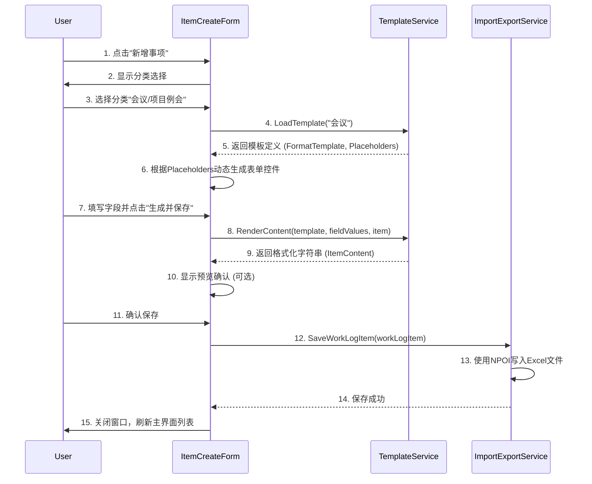
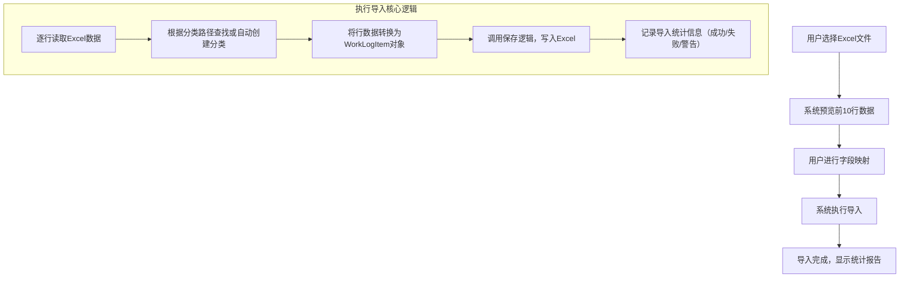

# 工作日志桌面应用 - 完整项目设计文档

## 1. 项目概述

### 1.1 项目目标

本项目旨在开发一款基于 **.NET Framework 4.7.2** 的桌面工作日志系统，专为 **Windows 7** 和 **Windows 10** 操作系统环境设计。该系统的核心目标是提供一个高效、便捷的工具，帮助用户通过**可配置的文本模板**快速生成格式化的工作日志条目。日志一旦生成，将与模板完全解耦，以纯文本形式独立存储，确保内容的稳定性和可追溯性。系统的设计充分考虑了老旧操作系统的兼容性，确保在 Windows 7 SP1 及以上版本中无需额外安装运行时环境即可稳定运行。通过采用 WinForms 技术，系统能够快速开发并提供一个成熟稳定的用户界面，同时利用 NPOI 库实现对 Excel 文件的无 COM 依赖操作，确保数据存储的灵活性和可移植性。此外，系统还支持多级分类体系和流程状态追踪，使用户能够更好地组织和管理日常工作任务，提升工作效率。

### 1.2 核心特性

本工作日志桌面应用具备多项核心特性，旨在为用户提供全面而高效的日志管理体验。首先，系统支持**模板驱动创建**，用户可以通过填写预设的表单字段，自动生成格式化的文本内容，极大地简化了日志编写过程。其次，系统采用**完全解耦的存储方式**，日志一旦保存，即为独立的纯文本文件，与原始模板无任何关联，确保了日志内容的独立性和长期可读性。此外，系统内置了**多级分类体系**，允许用户自定义分类树，并为每个分类绑定特定的模板，从而实现更精细化的日志管理。在流程管理方面，系统提供了待处理、进行中、已完成、已阻塞和已取消五种状态，帮助用户清晰追踪任务进度。为了方便数据交换，系统还支持 Excel 文件的导入和导出功能，用户可以轻松地将日志数据与其他系统进行交互。最后，考虑到不同用户的使用环境，系统特别优化了对 Windows 7 操作系统的兼容性，基于 .NET Framework 4.7.2 和 WinForms 技术构建，确保了在老旧系统上的稳定运行。

## 2. 技术架构设计

### 2.1 技术栈选型

为了实现项目目标并确保系统的稳定性、兼容性和可维护性，我们经过审慎评估，选定了以下技术栈。这些技术的选择充分考虑了开发效率、运行性能以及在目标 Windows 平台上的部署便捷性。

| 层级           | 技术                | 版本       | 说明                                                         |
| :------------- | :------------------ | :--------- | :----------------------------------------------------------- |
| **框架**       | **.NET Framework**  | **4.7.2**  | 选择 .NET Framework 4.7.2 作为基础运行框架，主要因为它对 Windows 7 SP1 及更高版本的操作系统提供了原生支持。这意味着最终用户无需在他们的计算机上安装任何额外的 .NET 运行时或组件包，从而实现了真正的“开箱即用”和绿色部署，极大地简化了软件的安装和分发过程。 |
| **UI**         | **WinForms**        | 内置       | 用户界面层采用 Windows Forms (WinForms) 技术。WinForms 是 .NET Framework 内置的 UI 框架，拥有丰富的控件库和成熟的设计器支持，能够快速构建出功能完备、交互友好的桌面应用程序。其稳定性和对 Windows 原生控件的良好封装，使得开发过程高效且界面风格与操作系统保持一致。 |
| **Excel 操作** | **NPOI**            | **4.5.1**  | 为了实现与 Excel 文件的交互，包括读取和写入 `.xlsx` 格式的文件，我们选用了 NPOI 库。NPOI 是一个开源的 .NET 平台下操作 Office 文档的库，其最大优势在于不依赖于 Microsoft Office 的 COM 组件。这意味着即使用户计算机上没有安装 Office 套件，应用程序也能正常处理 Excel 文件，避免了 COM 交互带来的性能开销和版本兼容性问题。 |
| **JSON 处理**  | **Newtonsoft.Json** | **13.0.3** | 系统中的模板配置信息将以 JSON 格式存储。Newtonsoft.Json (也称为 Json.NET) 是 .NET 生态中功能最强大、使用最广泛的 JSON 序列化和反序列化库。它提供了极高的性能、灵活的配置选项以及对复杂对象结构的完美支持，能够轻松地将 C# 对象与 JSON 字符串进行相互转换，是处理模板配置的理想选择。 |
| **数据访问**   | **-**               | **-**      | 根据项目需求变更，原有的 SQLite 数据库已被移除。数据将直接存储在 Excel 文件中，因此不再需要专门的数据访问层或 ORM 框架（如 Dapper）。业务逻辑层将直接调用 NPOI 库提供的 API 来完成对 Excel 文件的读写操作，简化了架构并减少了外部依赖。 |

### 2.2 项目分层结构

为了遵循关注点分离（Separation of Concerns）的设计原则，确保代码的可读性、可维护性和可扩展性，项目采用了清晰的多层架构。整个解决方案被划分为多个独立的逻辑层，每一层都承担着明确的职责。

```text
WorkLogApp/
├── **WorkLogApp.UI**/             # WinForms 应用程序 (Presentation Layer)
│   ├── **Forms**/                 # 所有窗体
│   │   ├── **MainForm.cs**       # 主界面
│   │   ├── **ItemCreateForm.cs** # 模板创建窗口
│   │   ├── **ItemEditForm.cs**   # 纯文本编辑窗口
│   │   ├── **CategoryManageForm.cs** # 分类与模板管理
│   │   └── **ImportWizardForm.cs**  # 导入向导
│   ├── **Controls**/              # 自定义控件
│   │   ├── **CategoryTreeComboBox.cs**
│   │   └── **DynamicFormPanel.cs** # 动态生成模板表单
│   └── **Program.cs**
│
├── **WorkLogApp.Core**/           # 核心模型与工具 (Domain Layer)
│   ├── **Models**/
│   │   ├── **WorkLog.cs**        # 日志主表（每日）
│   │   ├── **WorkLogItem.cs**    # 日志事项
│   │   └── **Category.cs**       # 分类树
│   ├── **Enums**/
│   │   ├── **StatusEnum.cs**     # 状态枚举
│   │   └── **CategoryTypeEnum.cs** # 分类类型枚举
│   └── **Utils**/
│       └── **StringSimilarityHelper.cs**
│
├── **WorkLogApp.Services**/       # 业务逻辑服务 (Business Logic Layer)
│   ├── **Interfaces**/
│   │   ├── **ICategoryService.cs**
│   │   ├── **ITemplateService.cs**
│   │   └── **IImportExportService.cs**
│   └── **Implementations**/
│       ├── **CategoryService.cs**
│       ├── **TemplateService.cs** # 模板渲染核心
│       └── **ImportExportService.cs** # 导入导出逻辑
│
└── **Templates**/                 # 模板配置
    └── **templates.json**         # JSON 模板文件
```

**各层职责详解：**

*   **WorkLogApp.UI (表示层):** 这是与用户直接交互的层，负责所有界面的展示和用户输入的接收。它包含了所有的 WinForms 窗体（`Forms`）和自定义控件（`Controls`）。该层不直接处理业务逻辑，而是通过调用 `WorkLogApp.Services` 层提供的接口来完成用户请求。例如，当用户点击“保存”按钮时，`MainForm` 会收集界面上的数据，然后调用 `IWorkLogService` 的相应方法来保存日志。

*   **WorkLogApp.Core (核心/领域层):** 这一层是整个应用程序的业务核心，定义了所有核心的业务实体（`Models`）、枚举（`Enums`）和通用工具类（`Utils`）。`WorkLogItem`、`Category` 等模型类都定义于此。这一层不包含任何特定于 UI 或数据访问的代码，保持了业务逻辑的纯粹性，使其可以被其他层（如服务层）复用。

*   **WorkLogApp.Services (业务逻辑层):** 该层封装了所有的业务规则和操作逻辑。它通过实现一系列接口（`Interfaces`）来定义其功能，例如 `ITemplateService` 负责模板的加载和渲染，`IImportExportService` 负责处理 Excel 的导入导出。具体的实现类（`Implementations`）则包含了这些逻辑的代码。服务层依赖于 `WorkLogApp.Core` 中的模型，并直接调用 NPOI 等外部库来完成对 Excel 文件的操作，从而取代了原有的数据访问层。

*   **Templates (配置层):** 这是一个特殊的文件夹，用于存放应用程序的配置文件，主要是 `templates.json`。该文件定义了所有可用的日志模板，包括模板的格式字符串和占位符信息。通过将模板外置到 JSON 文件中，使得模板的修改和扩展变得非常灵活，无需重新编译应用程序。

## 3. 数据存储设计

根据项目需求的变更，原有的 SQLite 数据库已被完全移除，数据存储方案全面转向基于 Excel 文件的结构化存储。这种设计不仅满足了“每月一个文件，每天一个 Sheet”的核心要求，也使得数据的查看和分享变得更加直观和便捷，因为 Excel 是办公环境中广泛使用的标准格式。

### 3.1 Excel 存储结构

#### 3.1.1 文件与Sheet命名规则

为了高效地组织和检索日志数据，我们设计了一套清晰且易于解析的命名规范。

*   **文件命名规则:** 日志数据按月份进行聚合存储。每个月的所有日志将保存在一个独立的 Excel 文件中。文件命名格式为 `worklog_YYYYMM.xlsx`。例如，**2025年11月**的所有日志将被存储在名为 **`worklog_202511.xlsx`** 的文件中。这种命名方式使得通过文件名即可快速定位到特定月份的日志，便于按月度进行归档和管理。

*   **Sheet命名规则:** 在每个月的 Excel 文件中，每一天的日志数据被放置在一个独立的工作表（Sheet）中。Sheet 的命名格式为 `YYYY-MM-DD`。例如，**2025年11月10日**的日志将存储在名为 **`2025-11-10`** 的 Sheet 中。这种设计将每天的日志内容完全隔离，避免了数据混杂，同时也非常符合用户按天查看和记录日志的习惯。当用户需要查看某一天的日志时，应用程序可以迅速定位到对应的文件和 Sheet，实现快速加载。

#### 3.1.2 表头列定义

每个以日期命名的 Sheet 都将包含一个标准化的表头，用于定义日志事项的各项属性。以下是详细的列定义及其说明：

| 列名             | 数据类型 (Excel)      | 说明                                                         | 是否必填 |
| :--------------- | :-------------------- | :----------------------------------------------------------- | :------- |
| **LogDate**      | 日期型 (Date)         | 日志事项发生的日期，与 Sheet 名一致。                        | 是       |
| **ItemTitle**    | 文本型 (Text)         | 事项标题，对日志内容的简短概括，便于快速浏览。               | 是       |
| **ItemContent**  | 文本型 (Text)         | **纯文本日志内容**，这是日志的核心部分，由模板渲染生成，包含了详细的记录信息。 | 是       |
| **CategoryId**   | 数字型 (Number)       | 分类 ID，关联到 `Category` 模型，用于标识该日志事项所属的类别。 | 是       |
| **Status**       | 数字型 (Number)       | 状态，存储状态枚举的整数值，如 0=待处理, 1=进行中, 2=已完成等。 | 是       |
| **Progress**     | 数字型 (Number)       | 进度，一个 0 到 100 的整数，表示任务的完成百分比。           | 否       |
| **StartTime**    | 日期时间型 (DateTime) | 开始时间（可选），记录任务或事件的开始时刻。                 | 否       |
| **EndTime**      | 日期时间型 (DateTime) | 结束时间（可选），记录任务或事件的结束时刻。                 | 否       |
| **Tags**         | 文本型 (Text)         | 标签，以逗号分隔的字符串，用于为日志添加多个关键词，便于后续筛选和搜索。 | 否       |
| **SortOrder**    | 数字型 (Number)       | 排序序号，用于在同一天的多个日志事项中定义其显示顺序。       | 否       |
| **DailySummary** | 文本型 (Text)         | 当日总结（每表一份），此列仅在当天的第一条记录中填写，用于概述当天的工作重点或心得。 | 否       |

### 3.2 JSON 模板格式

为了提供灵活且易于维护的模板系统，所有模板定义都将存储在一个名为 `templates.json` 的 JSON 文件中。该文件位于应用程序根目录下的 `Templates` 文件夹内。使用 JSON 格式的好处是其结构清晰、易于阅读和编辑，并且可以被 .NET 程序通过 Newtonsoft.Json 库轻松解析。

#### 3.2.1 模板文件结构

`templates.json` 文件将包含一个顶层对象，该对象中有一个名为 `Templates` 的属性。`Templates` 是一个字典（或对象），其键（Key）是分类的名称（如“会议”、“研发”），值（Value）是一个对象，定义了该分类对应的模板详情。这种结构使得通过分类名称查找对应模板变得非常高效。

每个模板对象主要包含两个核心属性：
*   `FormatTemplate`: 一个字符串，定义了日志的最终输出格式。其中可以包含占位符（如 `{会议地点}`），这些占位符将在运行时被用户输入的实际值替换。
*   `Placeholders`: 一个对象，定义了 `FormatTemplate` 中所有占位符的详细信息。这个对象的键是占位符的名称，值则定义了该占位符对应的 UI 控件类型（如 `text`, `textarea` 等）。

#### 3.2.2 模板示例

以下是一个 `templates.json` 文件的完整示例，定义了一个名为“会议”的分类模板：

```json
{
  "Templates": {
    "会议": {
      "CategoryTemplate": {
        "FormatTemplate": "# 项目例会记录\n**地点**：{会议地点}\n**参会**：{参会人员}\n**议题**：{关键议题}\n\n**问题风险**：\n{问题风险}",
        "Placeholders": {
          "会议地点": "text",
          "参会人员": "text",
          "关键议题": "textarea",
          "问题风险": "textarea"
        }
      }
    }
  }
}
```

在这个示例中：
*   当用户选择“会议”分类时，系统会加载这个模板。
*   `FormatTemplate` 定义了日志的 Markdown 格式。`\n` 代表换行符。
*   `Placeholders` 对象定义了四个输入字段：
    *   `会议地点` 和 `参会人员` 将渲染为单行文本框 (`text`)。
    *   `关键议题` 和 `问题风险` 将渲染为多行文本框 (`textarea`)。
*   用户在界面上填写这些字段后，系统会将 `{会议地点}`、`{参会人员}` 等占位符替换为用户输入的内容，从而生成最终的 `ItemContent`。

## 4. 模板系统设计

模板系统是本项目最具特色的核心模块，它实现了从结构化输入到格式化文本的自动化转换，是提升日志记录效率和规范性的关键。该系统的设计围绕着模板格式规范、动态表单生成和模板渲染三个主要环节展开。

### 4.1 模板格式规范

为了确保模板引擎能够正确解析和处理模板，我们定义了一套简洁而强大的格式规范。这套规范主要涉及占位符的语法以及如何根据占位符类型映射到相应的用户界面控件。

#### 4.1.1 占位符语法

占位符是模板系统的核心，它标记了在最终生成的文本中需要被动态替换的部分。我们定义了以下占位符语法规则：

*   **基本语法:** 占位符使用大括号 `{}` 包裹，格式为 `{字段名称}`。例如，`{会议地点}` 就是一个占位符，它将在渲染时被替换为实际的会议地点信息。
*   **日期格式化:** 对于日期时间类型的字段，支持自定义格式化。语法为 `{字段名称:格式说明}`。例如，`{会议时间:yyyy-MM-dd HH:mm}` 会将 `会议时间` 字段的值格式化为 "2025-11-10 14:00" 的形式。这为处理时间信息提供了极大的灵活性。
*   **系统级字段:** 除了用户在模板中自定义的字段外，系统还预留了一些系统级字段，如 `{ItemTitle}` (事项标题) 和 `{CategoryPath}` (分类完整路径)。这些字段的值由应用程序在运行时自动提供，无需用户手动输入，进一步增强了模板的动态性。

#### 4.1.2 字段类型与控件映射

为了让用户能够方便地为模板中的占位符提供值，我们需要将每个占位符映射到一个合适的 UI 控件。`Placeholders` 配置项正是为此而设计。我们定义了以下几种字段类型及其对应的 UI 控件映射关系：

| 字段类型   | UI 控件                         | 值格式   | 示例输出                      |
| :--------- | :------------------------------ | :------- | :---------------------------- |
| `text`     | 单行 TextBox                    | string   | "会议室A"                     |
| `textarea` | 多行 TextBox                    | string   | "详细描述\n多行文本"          |
| `select`   | ComboBox (下拉框)               | string   | "高优先级"                    |
| `checkbox` | CheckedListBox (复选框列表)     | string[] | ["需求", "Bug"] → "需求、Bug" |
| `datetime` | DateTimePicker (日期时间选择器) | string   | "2025-11-10 14:00"            |

这种映射关系是动态表单生成的基础。例如，当模板引擎解析到 `Placeholders` 中 `"会议地点": "text"` 的配置时，它就知道需要为 `会议地点` 这个占位符在界面上生成一个单行的文本输入框。

### 4.2 动态表单生成流程

动态表单生成是连接模板定义和用户交互的桥梁。当用户创建一个新的日志事项时，系统会根据其选择的分类，实时生成一个与之匹配的输入表单。这个流程可以概括为以下步骤：

1.  **用户选择分类:** 用户在 `ItemCreateForm` 中选择一个分类，例如“会议”。
2.  **加载模板:** 系统通过 `TemplateService` 从 `templates.json` 文件中读取与“会议”分类对应的模板定义。
3.  **解析占位符:** `TemplateService` 解析模板中的 `Placeholders` 对象，提取出所有需要用户输入的字段及其类型。
4.  **生成控件:** 系统遍历这些占位符定义。对于每一个占位符，根据其类型（如 `text`, `textarea`），动态地在 `DynamicFormPanel` 上创建一个对应的 UI 控件（如 `TextBox`, `TextBox` with `Multiline=true`）。同时，系统还会为每个控件生成一个标签（Label），显示占位符的名称（如“会议地点：”）。
5.  **显示窗口:** 所有控件生成完毕后，`ItemCreateForm` 会显示这个动态生成的表单，等待用户填写。
6.  **用户提交:** 用户填写完表单并点击“生成并保存”按钮。
7.  **渲染内容:** 系统收集所有控件的值，调用 `TemplateService` 的渲染引擎，将这些值填充到 `FormatTemplate` 字符串中，生成最终的纯文本日志内容。
8.  **保存数据:** 最后，系统将生成的纯文本内容以及其他元数据（如日期、分类ID等）通过 `ImportExportService` 写入到对应的 Excel 文件中。

### 4.3 模板渲染算法

模板渲染是模板系统的最后一步，也是将用户输入转化为最终成果的关键环节。其核心算法 `TemplateService.Render()` 负责执行字符串替换和格式化操作。

**算法输入:**
*   `template`: 字符串，即 `FormatTemplate` 的内容。
*   `fieldValues`: 字典 (`Dictionary<string, object>`)，包含了用户在动态表单中输入的所有值，键为占位符名称，值为用户输入。
*   `item`: `WorkLogItem` 对象，包含了系统级的数据，如 `ItemTitle` 和 `CategoryPath`。

**算法处理流程:**
1.  **遍历用户输入:** 算法首先遍历 `fieldValues` 字典。对于每一个键值对，它会在 `template` 字符串中查找 `{key}` 模式的占位符，并将其替换为对应的 `value`。
    *   对于 `checkbox` 类型的输入（`string[]`），算法会将其中的多个字符串用顿号连接成一个单一的字符串，例如 `["需求", "Bug"]` 会被转换为 "需求、Bug"。
    *   对于 `datetime` 类型的输入，算法会将其格式化为标准的字符串，如 `ToString("yyyy-MM-dd HH:mm")`。
2.  **替换系统占位符:** 接着，算法会处理系统级的占位符。例如，它会将 `{ItemTitle}` 替换为 `item.ItemTitle` 的值，将 `{CategoryPath}` 替换为通过 `CategoryId` 查询到的分类完整路径。
3.  **处理自定义日期格式:** 算法会使用正则表达式（如 `\{(\w+):([^}]+)\}`）来匹配带有自定义格式说明的日期占位符。一旦匹配成功，它会提取出字段名称和格式字符串，并对相应的日期时间字段应用该格式。
4.  **清理与优化:** 最后，算法会对生成的文本进行清理和优化。这包括删除仅包含空白字符的空行，以及将多个连续的空行合并为一个，以确保最终输出的日志内容整洁、美观。

**算法输出:**
*   一个纯字符串，即最终渲染完成的 `ItemContent`，可以直接保存到 Excel 文件中。

## 5. UI/UX 详细设计

### 5.1 主界面布局 (MainForm)

主界面是用户与系统交互的中心枢纽，其布局设计充分考虑了信息的分区和操作的便捷性。

```
┌──────────────────────────────────────────────────────────────────────┐
│ 工作日志系统 v1.0                                    [最小化][关闭] │
├──────────────────────────────────────────────────────────────────────┤
│ 菜单栏：文件 | 编辑 | 分类管理 | 工具 | 帮助                         │
├──────────────────────────────────────────────────────────────────────┤
│ 工具栏： [新增] [编辑] [删除] [刷新] [导出] [导入向导] [去重工具]    │
├──────────────────┬───────────────────────────────────────────────────┤
│  日期导航        │  日志事项列表（卡片流）                           │
│                  │                                                   │
│  ▼ 2025年11月    │  ─────────────────────────────────────────────  │
│    ├─ 10 (3)    │  ⚙️ 后端开发/API开发   ⏰ 10:00~11:00   ✅      │
│    └─ 09 (5)    │  📄 调试用户登录接口，修复参数格式错误。已完成   │
│                  │     联调和单元测试。                              │
│  [按月汇总]      │                                                   │
│  [按周汇总]      │  ─────────────────────────────────────────────  │
│                  │  💬 会议/项目例会   ⏰ 14:00~15:30   ✅         │
│  分类筛选        │  📄 📅 项目例会记录                               │
│  ☑ 研发 (8)     │      🏢 地点：会议室A                             │
│  ☑ 会议 (3)     │      👥 参会：张三、李四、王五                    │
│  ☐ 其他 (1)     │      🎯 议题：需求评审、进度同步                  │
│                  │                                                   │
│  标签筛选        │      ⚠️ 问题风险：                                │
│  🔥 评审 (5)    │      无                                           │
│  🐛 Bug (2)     │                                                   │
│  📚 学习 (1)    │  ─────────────────────────────────────────────  │
│                  │                                                   │
│                  │  [新增事项]  [从模板创建]  [复制昨日]           │
└──────────────────┴───────────────────────────────────────────────────┘
```

**交互说明:**
*   **日期导航:** 界面左侧是一个可折叠的日期导航树。它以月份为单位进行组织，点击月份可以展开查看该月的所有日期。每个日期旁边会显示一个数字，代表当天记录的日志事项数量，例如 `10 (3)` 表示11月10日有3条日志。用户点击具体日期即可在右侧加载并显示该日的所有日志。
*   **日志事项列表:** 界面右侧是日志事项的主要展示区域。日志以卡片流的形式呈现，每张卡片清晰地展示了日志的分类图标、标题、时间范围、状态以及内容摘要。这种卡片式设计使得信息一目了然，便于用户快速浏览。
*   **筛选功能:** 在日期导航下方，提供了分类筛选和标签筛选功能。用户可以通过勾选或取消勾选不同的分类或标签，实时过滤右侧的日志列表，快速定位到感兴趣的内容。筛选支持多选，提供了强大的组合查询能力。
*   **工具栏与快捷操作:** 顶部的工具栏集成了最常用的操作按钮，如“新增”、“编辑”、“删除”等。在日志列表的底部，还提供了“新增事项”、“从模板创建”和“复制昨日”等快捷操作按钮，进一步提升了操作效率。

### 5.2 创建窗口 (ItemCreateForm)

创建窗口是用户通过模板生成新日志的核心界面。它的独特之处在于其表单区域是动态生成的，完全取决于用户所选分类的模板定义。

```
┌───────────────────────────────────────────────────────────────┐
│ 创建新事项（模板辅助）                               [关闭]   	    │
├───────────────────────────────────────────────────────────────┤
│                                                               │
│ 分类： [会议/项目例会  v]                                        │
│                                                               │
│ 动态表单区域（根据模板生成）                                  │
│ ┌───────────────────────────────────────────────────────────┐ │
│ │ 会议地点：    [会议室A                ]                  │ │
│ │ 参会人员：    [张三、李四              ]                  │ │
│ │ 会议时间：    [2025-11-10 14:00]  ~  [15:30]             │ │ 
│ │ 关键议题：    ☑ 需求评审  ☑ 进度同步  ☐ 风险           │ │
│ │ 会议纪要：    ┌──────────────────────────────┐           │ │
│ │               │ 多行文本框                   │           │ │
│ │               └──────────────────────────────┘           │ │
│ └───────────────────────────────────────────────────────────┘ │
│                                                               │
│ 简要标题：[项目例会-需求评审]                              │
│ 状态：   [待处理 v]  进度：[____]%                         │
│ 标签：   [评审, 项目A]                                     │
│                                                               │
│ [生成并保存]  [取消]  [应用模板预览]                        │
└───────────────────────────────────────────────────────────────┘
```

**字段生成规则:**
窗口中的动态表单区域会根据 `templates.json` 中定义的 `Placeholders` 自动生成。具体的生成规则如下：
*   `{会议地点}` → 生成一个 `Label` 显示“会议地点：”，旁边是一个单行的 `TextBox`。
*   `{会议时间}` → 生成一个 `Label` 显示“会议时间：”，旁边是两个 `DateTimePicker` 控件，用于选择开始和结束时间。
*   `{关键议题}` → 生成一个 `Label` 显示“关键议题：”，旁边是一个 `CheckedListBox`，列出了所有可选议题。
*   `{会议纪要}` → 生成一个 `Label` 显示“会议纪要：”，旁边是一个多行的 `TextBox`。

在动态表单区域下方，还提供了一些通用的元数据输入字段，如“简要标题”、“状态”、“进度”和“标签”，这些字段对所有类型的日志都是通用的。

### 5.3 编辑窗口 (ItemEditForm)

编辑窗口允许用户对已创建的日志进行修改。与创建窗口不同，编辑窗口的核心是一个纯文本编辑器，用户可以直接修改日志的最终内容。同时，它也保留了重新应用模板生成的能力。

```
┌───────────────────────────────────────────────────────────────┐
│ 编辑事项                                             [关闭]    │
├───────────────────────────────────────────────────────────────┤
│                                                               │
│ 分类：会议/项目例会（只读）                                 │
│ 标题：[项目例会-需求评审]                                  │
│ 标签：[评审, 项目A]                                        │
│ 状态：[已完成 v]  进度：[100]%                             │
│ 时间：开始[2025-11-10 14:00]  结束[15:30]                  │
│                                                               │
│ 内容（直接编辑）：                                           │
│ ┌───────────────────────────────────────────────────────────┐ │
│ │📅 项目例会记录                                            │ │
│ │🏢 地点：会议室A                                           │ │
│ │👥 参会：张三、李四、王五                                  │ │
│ │🎯 议题：需求评审、进度同步                                │ │
│ │                                                           │ │
│ │⚠️ 问题风险：                                              │ │
│ │无                                                         │ │
│ │                                                           │ │
│ │⏰ 会议时间：2025-11-10 14:00 ~ 15:30                     │ │
│ └───────────────────────────────────────────────────────────┘ │
│                                                               │
│              [保存]  [取消]  [使用模板重新生成]              │
└───────────────────────────────────────────────────────────────┘
```

**重新生成警告:**
编辑窗口提供了一个“使用模板重新生成”的按钮。当用户点击此按钮时，系统会弹出一个确认对话框，提示用户：“**此操作将清空当前所有内容，使用模板重新生成，是否继续？**”。这是一个重要的安全设计，旨在防止用户意外丢失手动编辑的内容。如果用户确认，系统将关闭编辑窗口，并打开创建窗口，同时预填好该日志的分类，让用户可以基于原始模板重新生成内容。

## 6. 核心业务流程

### 6.1 完整创建流程

日志的创建流程是系统最核心的业务逻辑之一，它清晰地展示了从用户发起请求到数据最终保存的完整交互过程。该流程通过模板系统实现了高度的自动化。



**流程详解:**
1.  **发起请求:** 用户在主界面点击“新增事项”按钮。
2.  **选择分类:** 系统弹出创建窗口，用户从分类下拉框中选择一个分类，例如“会议/项目例会”。
3.  **加载模板:** 创建窗口通过 `TemplateService` 请求加载与所选分类对应的模板。
4.  **返回模板:** `TemplateService` 从 `templates.json` 文件中读取模板定义，并将其返回给 UI。
5.  **动态生成表单:** 创建窗口根据模板定义中的 `Placeholders`，在 `DynamicFormPanel` 上动态生成相应的输入控件。
6.  **用户输入:** 用户在生成的表单中填写各项信息。
7.  **提交生成:** 用户点击“生成并保存”按钮。UI 收集所有输入值，并调用 `TemplateService` 的 `RenderContent` 方法。
8.  **模板渲染:** `TemplateService` 将用户输入的值填充到 `FormatTemplate` 中，生成最终的纯文本日志内容。
9.  **保存数据:** UI 将所有数据（包括渲染后的内容和元数据）打包成一个 `WorkLogItem` 对象，并调用 `ImportExportService` 的 `SaveWorkLogItem` 方法。
10. **写入Excel:** `ImportExportService` 使用 NPOI 库，将 `WorkLogItem` 的数据写入到对应的 Excel 文件和 Sheet 中。
11. **完成反馈:** 保存成功后，`ImportExportService` 通知 UI，UI 关闭创建窗口并刷新主界面的日志列表，用户可以看到新创建的日志。

### 6.2 导入向导流程

导入向导功能旨在帮助用户将外部 Excel 文件中的数据批量导入到系统中，或者用于恢复之前导出的数据。该流程设计得尽可能智能和用户友好。



**流程详解:**
1.  **选择文件:** 用户在导入向导的第一步，通过文件选择器选择一个 Excel 文件。
2.  **预览数据:** 系统读取该 Excel 文件的前 10 行数据，并以表格形式展示给用户，让用户可以预览数据的结构和内容。
3.  **字段映射:** 向导的下一步是字段映射界面。系统会列出 Excel 文件中的列标题，并提供下拉框让用户将其映射到 `WorkLogItem` 的对应属性上（如将 Excel 的“内容”列映射到 `ItemContent`）。系统会尝试根据列名自动进行匹配，减少用户操作。
4.  **执行导入:** 用户确认映射关系后，点击“开始导入”。系统进入后台处理流程。
5.  **后台处理:** 在后台，系统会逐行读取 Excel 文件中的数据。对于每一行：
    *   它会根据用户映射的配置，将单元格的值赋给 `WorkLogItem` 对象的相应属性。
    *   如果数据中包含分类路径，系统会尝试查找现有分类，如果找不到且配置允许，则会自动创建新分类。
    *   然后，系统会调用与创建日志相同的保存逻辑，将该 `WorkLogItem` 写入到当前的 Excel 存储中。
    *   在此过程中，系统会记录详细的日志，包括成功导入的行数、失败的行数以及任何警告信息（如数据格式错误）。
6.  **完成报告:** 导入完成后，向导会显示一个摘要报告，向用户展示导入的结果，包括成功、失败和警告的统计信息，并允许用户查看详细的错误日志。

## 7. 导入导出格式规范

### 7.1 Excel 导出模板

系统支持将日志数据导出为 Excel 文件，以便于备份、归档或分享给不使用本系统的同事。导出功能支持多种模式，其中最核心的是多 Sheet 模式。

**多 Sheet 模式（按日期）:**
*   **Sheet 命名:** 在这种模式下，导出的 Excel 文件会为每一天的日志创建一个独立的 Sheet。Sheet 的命名格式为 `YYYY-MM-DD_星期X`，例如 `2025-11-10_星期一`。这种命名方式既包含了日期信息，也包含了星期信息，更加直观。
*   **表头结构:** 每个 Sheet 的表头结构与内部存储的表头结构完全一致，包含了 `LogDate`, `ItemTitle`, `ItemContent` 等所有字段，确保导出的数据信息完整。
*   **当日总结:** 在每个日期 Sheet 的底部，系统会通过合并单元格的方式，单独展示该日的 `DailySummary`（当日总结），使其与具体的日志事项区分开来，突出其总结性质。

### 7.2 导入映射配置

导入功能需要处理来源各异的 Excel 文件，因此其设计必须兼具灵活性和健壮性。我们通过一套映射配置和导入策略来实现这一点。

**必填列:**
为了保证导入数据的基本可用性，系统要求导入的 Excel 文件必须包含以下列，并需要用户将其正确映射：
*   `日志日期` → `LogDate`: 标识日志所属的日期。
*   `分类路径` → `CategoryPath`: 用于确定日志的分类。系统会根据这个路径自动查找或创建分类。
*   `内容` → `ItemContent`: 日志的核心文本内容。如果此列为空，系统将无法创建有意义的日志。

**可选列:**
以下列是可选的，如果存在并被正确映射，系统会将其导入；如果不存在，系统会采用默认策略处理：
*   `事项标题` → `ItemTitle`: 如果此列为空，系统会自动从 `ItemContent` 中截取前 20 个字符作为标题。
*   `状态` → `Status`: 系统会尝试将文本（如“已完成”）映射到对应的枚举值。如果无法识别，则使用默认值。
*   `标签` → `Tags`: 以逗号分隔的标签字符串。
*   `进度` → `Progress`: 0-100 的整数。

**导入策略:**
为了处理各种不规范的数据，系统内置了以下容错和自动处理策略：
1.  **缺失标题:** 如果 `ItemTitle` 为空，系统会自动生成一个标题，格式为“【分类名】+ 日期 + 序号”，例如“【会议】20251110-001”。
2.  **分类不存在:** 如果在系统中找不到 `CategoryPath` 对应的分类，且配置文件 `config.ini` 中的 `AutoCreateCategory` 设置为 `true`，系统会自动创建一个新的顶级分类。用户可以在后续的分类管理功能中对其进行整理和调整。
3.  **时间格式错误:** 如果 `StartTime` 或 `EndTime` 的格式不符合标准，系统会记录一条警告信息，但不会中断整个导入过程，而是继续处理后续行。
4.  **状态无法识别:** 如果 `Status` 列的值无法被识别为预定义的状态（如“已完成”、“进行中”等），系统会将其默认设置为“待处理”状态。

## 8. 部署与运维

### 8.1 安装包结构

本应用程序设计为绿色软件，无需复杂的安装过程。最终交付的安装包是一个压缩文件，解压后即可直接运行。其内部文件结构如下：

```
WorkLogApp_v1.0/
├── **WorkLogApp.exe**             # 主程序可执行文件
├── **NPOI.dll**                   # NPOI 库，用于操作 Excel 文件
├── **Newtonsoft.Json.dll**        # Newtonsoft.Json 库，用于处理 JSON 配置
├── **Templates/**                 # 模板配置文件夹
│   └── **templates.json**         # 存储所有日志模板的 JSON 文件
└── **使用说明.txt**               # 简要的用户手册
```

**结构说明:**
*   `WorkLogApp.exe` 是应用程序的主入口点。
*   `NPOI.dll` 和 `Newtonsoft.Json.dll` 是程序运行所必需的第三方库。
*   `Templates` 文件夹及其中的 `templates.json` 文件是应用程序的核心配置，允许用户在不修改代码的情况下自定义和扩展日志模板。
*   `使用说明.txt` 提供了关于如何使用软件的基本指导。

### 8.2 配置文件 (config.ini)

应用程序的行为可以通过一个名为 `config.ini` 的配置文件进行自定义。该文件位于程序根目录，采用标准的 INI 文件格式，易于编辑。

```ini
[Excel]
MonthlyPath=./Monthly/  # 指定每月 Excel 文件的存储路径。默认为程序目录下的 Monthly 文件夹。

[Template]
TemplatePath=./Templates/templates.json  # 指定模板 JSON 文件的路径。默认为 Templates 文件夹下的 templates.json。

[Paths]
Backup=./Backup/  # 指定备份文件的存储路径。默认为程序目录下的 Backup 文件夹。

[Options]
AutoCreateCategory=true  # 布尔值。控制在导入数据时，如果遇到不存在的分类，是否自动创建新分类。
```

**配置项详解:**
*   **`[Excel]` 节:** 用于配置与 Excel 存储相关的选项。`MonthlyPath` 允许用户自定义每月日志文件的存放位置，便于将数据存储在特定的磁盘分区或网络驱动器上。
*   **`[Template]` 节:** 用于指定模板文件的位置。这使得高级用户可以维护多套模板，并通过修改此配置来切换使用。
*   **`[Paths]` 节:** 定义了备份文件的存放路径，为用户提供了集中管理备份数据的便利。
*   **`[Options]` 节:** 提供了一些全局性的功能开关。`AutoCreateCategory` 的设置直接影响导入功能的容错行为，用户可以根据自己的数据管理规范来决定是否开启自动创建分类的功能。

### 8.3 备份机制

为了防止数据丢失，系统提供了完善的备份机制，包括自动备份和手动备份两种方式。

*   **自动备份:** 系统可以在每次启动时检查当前日期与上次备份日期的差距。如果超过了 `config.ini` 中配置的 `AutoBackupDays`（例如，设置为 7 表示每7天备份一次），系统会自动将当前月份的 Excel 文件复制到 `Backup` 文件夹中，并在文件名中加入时间戳以示区分。这个过程对用户是透明的，确保了数据定期得到保护。
*   **手动备份:** 用户也可以通过菜单栏的“文件” -> “备份数据”选项，随时触发手动备份。点击后，系统会弹出一个对话框，允许用户选择备份文件的存放路径，提供了更大的灵活性。
*   **恢复数据:** 当需要恢复数据时，用户可以通过菜单栏的“文件” -> “恢复数据”选项，选择一个之前备份的 Excel 文件。系统会提示用户此操作将覆盖当前数据，并在用户确认后，用备份文件替换当前的日志文件，完成数据恢复。